# 算法:

### 1.质数分解定理

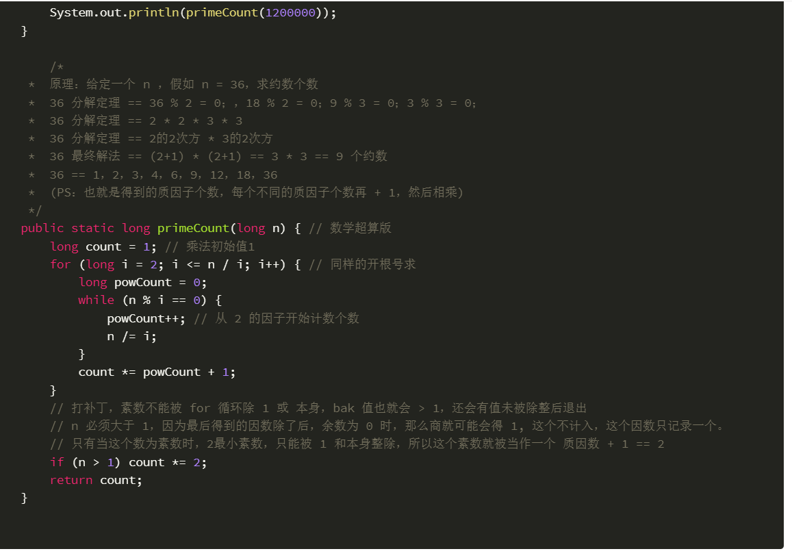


# 数学:

## 埃氏筛:

【【基础算法与数学】：素数筛1】https://www.bilibili.com/video/BV1FZAfz8ERi?vd_source=4746f77654d46a2fe6b71c42ffe9ce3c

```java
import java.util.*;

public class Main {

    static final int N = 1000007;
    static int[] primes = new int[N];
    static boolean[] st = new boolean[N];//默认都是false false代表素数

    public static void main(String[] args){
        Scanner sc = new Scanner(System.in);
        int n = sc.nextInt();
        int cnt = 0;

        for(int i=2;i<=n;i++){
            if(!st[i]){
                primes[cnt++] = i;
                for(int j=i+i;j<=n;j+=i) st[j] = true;
            }
        }

        System.out.println(cnt);
    }
}
```


### 1. P12157 [蓝桥杯 2025 省 Java B] 魔法科考试

### 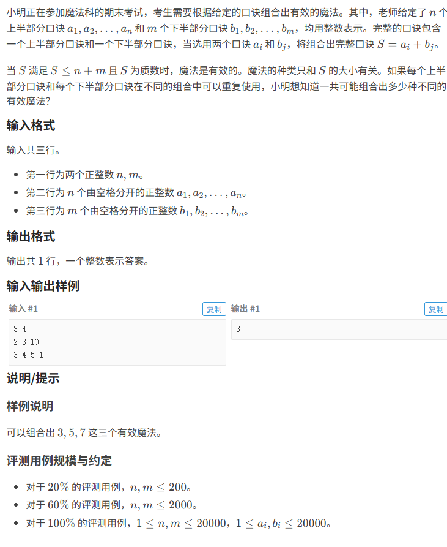

```java
import java.util.*;

public class Main{
    static final int N = 40007;
    static int[] primes = new int[N];
    static boolean[] st = new boolean[N]; //true 代表是素数


    public static void shai(int total){
        st[0]=false;
        st[1]=false;
        for (int i=2;i<=total;i++){
            st[i]=true;
        }
        for(int i=2;i<=total;i++){
            if(!st[i]) continue;
            for(int j=i+i;j<=total;j+=i){
                st[j]=false;
            }
        }
    }
    public static void main(String [] args){
        Scanner sc=new Scanner(System.in);
        int n=sc.nextInt();
        int m=sc.nextInt();
        int total=n+m;
        int[] a = new int[n];
        int[] b = new int[m];
        for (int i = 0; i < n; i++) a[i] = sc.nextInt();
        for (int i = 0; i < m; i++) b[i] = sc.nextInt();

        shai(total);

        HashSet<Integer> set=new HashSet<>();

        for(int i=0;i<n;i++){
            int ai=a[i];
            for(int j=0;j<m;j++){
                int bi=b[j];
                int S=ai+bi;
                if(S>total)continue;
                if(!st[S]) continue;
                set.add(S);
            }
        }
        System.out.println(set.size());
    }

}
```


### 2.P1579 哥德巴赫猜想（升级版）

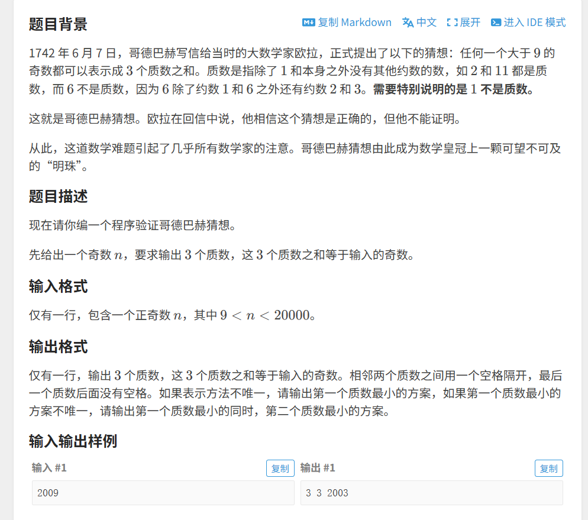

```java
import java.util.*;

public class Main{

        static final int N=20007;
        static int[] primes = new int[N];
        static boolean[] st = new boolean[N]; //false 代表是素数

        public static void main(String [] args){
            Scanner sc=new Scanner(System.in);
            int n =sc.nextInt();

            int cnt=0;
            for(int i=2;i<=n;i++){
                if(st[i]) continue; //如果是true直接跳过
                //false 的情况
                primes[cnt++]=i;
                for(int j=i+i;j<=n;j+=i) st[j]=true;
            }
            //筛完之后 素数都存在primes这个数组中
             for (int i = 0; i < cnt; i++) {
            // 中层循环 j 从 i 到 cnt-1，这样能保证第一个素数不会变大，同时让第二个素数尽可能小
            for (int j = i; j < cnt; j++) {
                // 内层循环 k 从 j 到 cnt-1，这样能保证前两个素数不变时，第三个素数尽可能小
                for (int k = j; k < cnt; k++) {
                    int sum = primes[i] + primes[j] + primes[k];
                    if (sum == n) {
                        System.out.printf("%d %d %d", primes[i], primes[j], primes[k]);
                        return;
                    }
                  // 优化：如果和已经大于n，可以提前结束内层循环
                    if (sum > n) {
                        break;
                    }
                }
            }
        }
        }
    }
```


###3. 查询最小质因子:

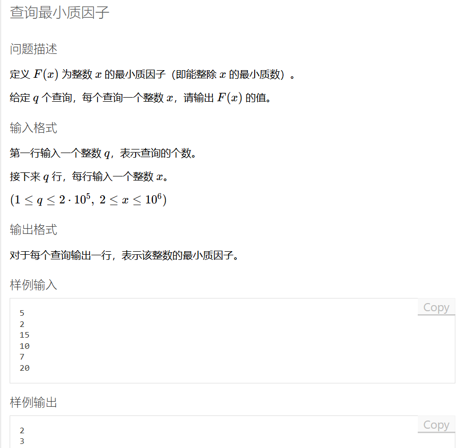

```java
import java.util.*;

public class Main{

    public static void main(String [] args){
        Scanner sc=new Scanner(System.in);
        int q=sc.nextInt();
        for(int i=0;i<q;i++){
            int x=sc.nextInt();
            int minNum=FindMin(x);
            System.out.println(minNum);
        }
    }

    public static int FindMin(int num){
        for(int i=2;i*i<=num;i++){
            if(num%i==0) return i;
        }
        return num;
    }
}
```


## 分解质因数:

[自建OJ：质因数分解](http://47.121.118.174/p/561)

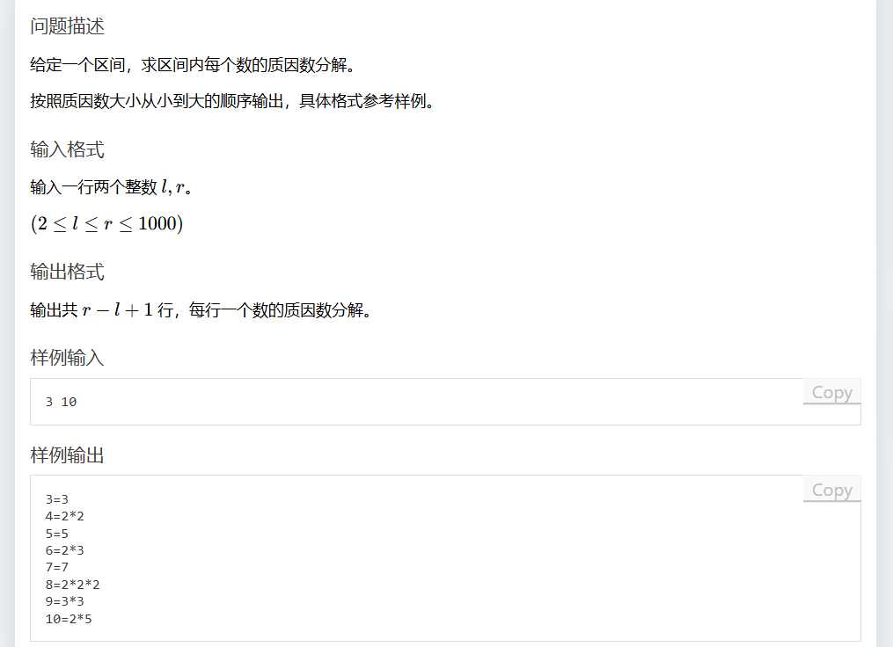

```JAVA
import java.util.*;

public class Main {

    static int[] v = new int[40];

    static void divide(int x){
        int len=0;
        System.out.print(x + "=");
        for(int i=2;i*i<=x;i++){
            while(x%i==0){
                x/=i;
                v[++len]=i;
            }
        }
        if(x>1) v[++len]=x;
        for(int i=1;i<len;i++) System.out.print(v[i] + "*");
        System.out.println(v[len]);
    }

    public static void main(String[] args){
        Scanner sc=new Scanner(System.in);
        int l=sc.nextInt();
        int r=sc.nextInt();
        for(int i=l;i<=r;i++) divide(i);
    }
}
```

[自建OJ：因子化简](http://47.121.118.174/p/562)

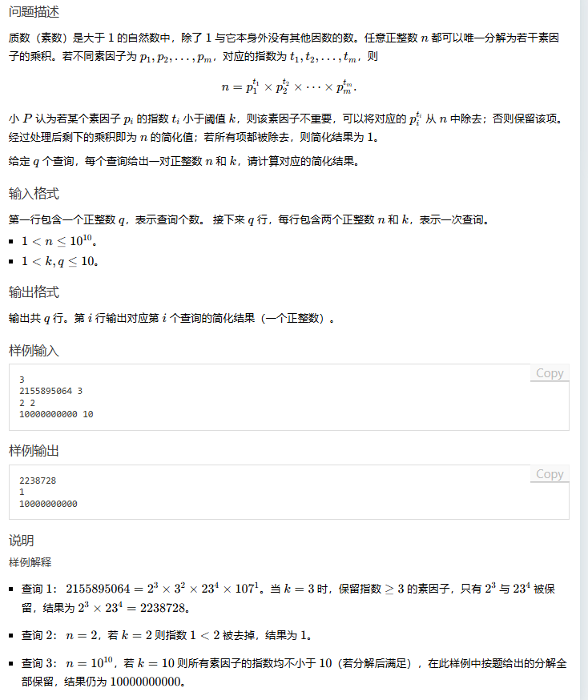

```java
package SuYinShu;
import java.util.*;

public class 因子简化{

    public static void main(String [] args){
        Scanner sc=new Scanner(System.in);
        int q=sc.nextInt();
        for(int i=1;i<=q;i++){
            long n=sc.nextLong();
            int k=sc.nextInt();
            Inquire(n,k);
        }
        sc.close();
    }

    public static void Inquire(long n,int k){
        long sum=1l;
        for(long i=2;i*i<=n;i++){
            int temp=0;
            while(n%i==0){
                temp++;
                n/=i;
            }
            if(temp>=k){
                sum=sum*pow(i,temp);
            }
        }
        // 如果 n > 1，说明存在一个指数为 1 的质因子
        //这个质因子指数一定为1,否则在前面中已经被除去了
        // 由于题目保证 k > 1，所以 1 >= k 不成立，无需处理
        // if (n > 1 && 1 >= k) { 这个判断是多余的
        //     sum = sum * n;
        // }
        System.out.println(sum);
    }

    public static long pow(long i,int temp){
        long result=1l;
        for(int j=1;j<=temp;j++){
            result*=i;
        }
        return result;
    }
}

```


## 最大公约数与最小公倍数:


### [洛谷：等差数列](https://www.luogu.com.cn/problem/P8682)

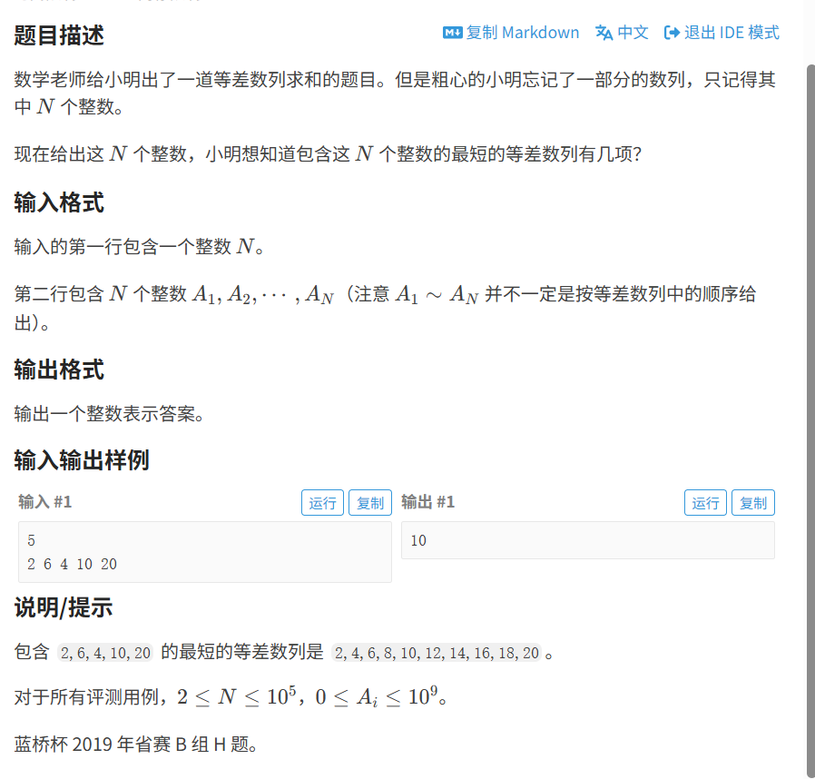

```java
package GcdAndLcm;
import java.util.*;

public class 等差数列{

    static final int NUM=100005;
    static int [] A = new int [NUM];

    public static void main(String [] args){
        Scanner sc =new Scanner(System.in);
        int N= sc.nextInt();
        //初始化数组
        for(int i=0;i<N;i++)     A[i]=sc.nextInt();
        //排序 注意：最好明确指定排序范围是 [0, N)，否则会把未初始化的元素也参与排序
        //在使用 Arrays.sort(array, fromIndex, toIndex) 时，toIndex 是不包含的
        Arrays.sort(A,0,N);

        //假设公差为 这两个数之差的若干倍
        int d=A[1]-A[0];
        //先要判断 公差为0的情况
        if(A[0]==A[N-1]) {
            System.out.println(N);//此时最短的等差数列就是这个N项的
            return;
        }
        //判断正常情况
        for(int i=1;i<N;i++){
            d=gcd(d,A[i]-A[i-1]);
        }
        //
        System.out.println((A[N-1]-A[0])/d +1);
    }
    public static int gcd(int a,int b){
        if(b==0) return a;
        return gcd(b,a%b);
    }
}
```

### [自建OJ：1~n的最小公倍数](http://47.121.118.174/p/24)

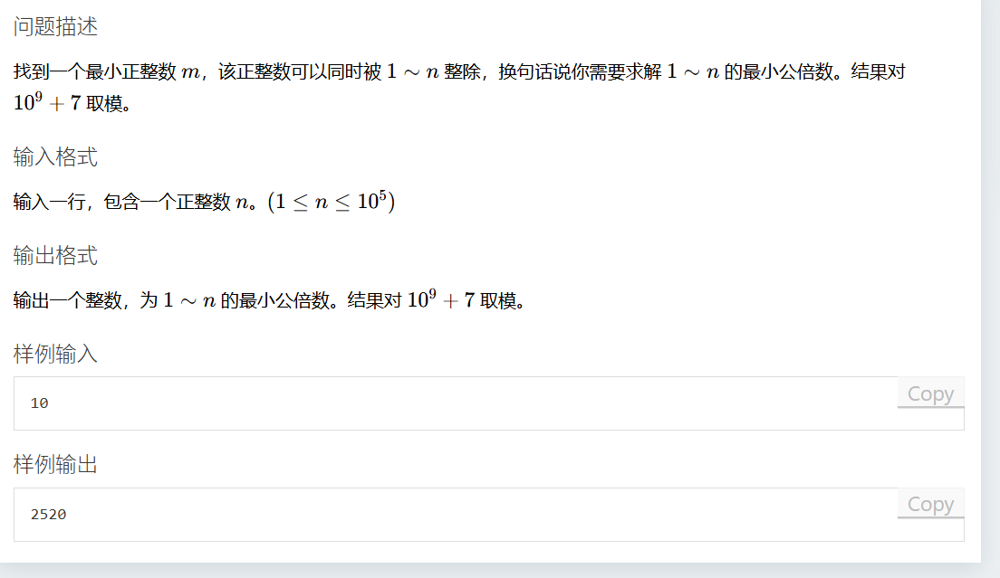

```java
public class 从1到n的最小公倍数{

    static final long mod = 1000000007;
    static HashMap<Integer,Integer> mp=new HashMap<>();
    static long ans=1;

    public static void main(String [] args){
        Scanner sc=new Scanner(System.in);
        int n = sc.nextInt();

        for(int i=2;i<=n;i++) divide(i);

        //质因数分解之后 遍历map集合
        for(Map.Entry<Integer,Integer> e:mp.entrySet()){
            int x=e.getKey();
            int y=e.getValue();
            for(int i=1;i<=y;i++) ans=ans*x%mod;//这样比乘完之后再取余更快
        }

        System.out.println(ans);

    }

    public static void divide(int num){
        //先进行 质因数分解
        for(int i=2;i*i<=num;i++){
            int cnt=0;
            while(num%i==0){
                cnt++;
                num/=i;
            }
            //将质因数的指数最大放入map集合中
            if(cnt>0){
                mp.put(i,Math.max(mp.getOrDefault(i,0),cnt));
            }
        }
        if(num>1){
            //对剩下的数字进行处理
            mp.put(num,Math.max(mp.getOrDefault(num,0),1));
        }
    }
}
```

[自建OJ：最小公倍数](http://47.121.118.174/p/491)

```java
import java.util.*;

public class Main {

    static long gcd(long a,long b){
        if(b==0) return a;
        return gcd(b,a%b);
    }

    public static void main(String[] args){
        Scanner sc=new Scanner(System.in);
        long a=sc.nextLong();
        long b=sc.nextLong();
        System.out.println(a*b/gcd(a,b));
    }
}
```


# 基础算法:

## 1.枚举:

### [洛谷：求回文数](https://www.luogu.com.cn/problem/B3882)

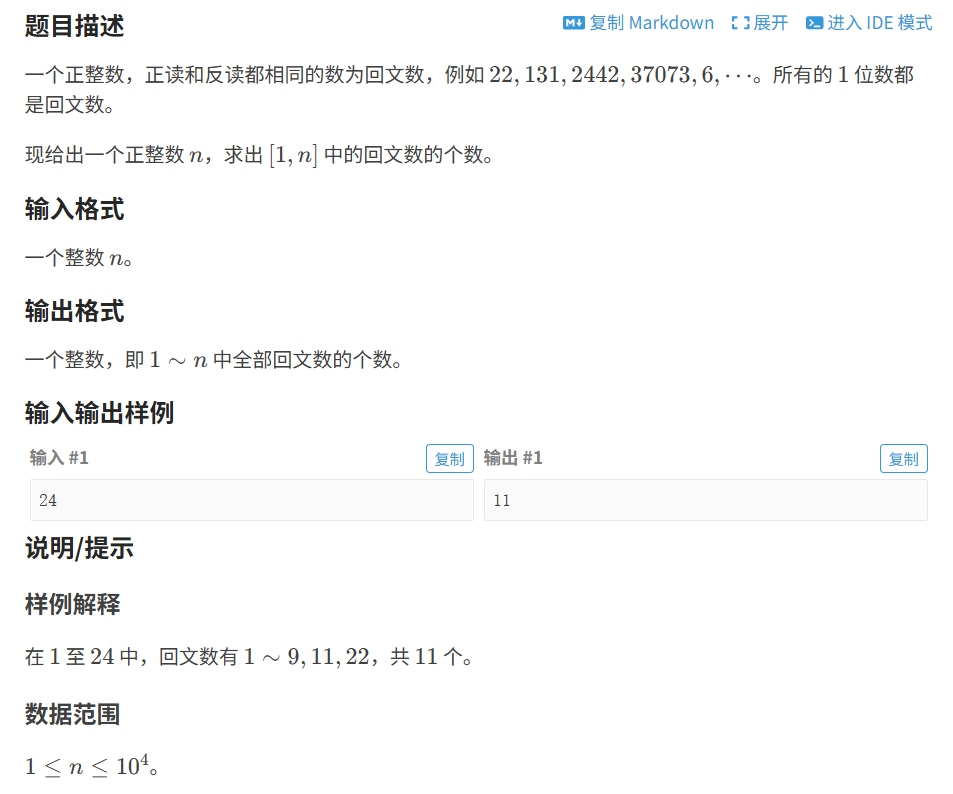

```java
import java.util.*;
//一边从前开始遍历 一边从最后开始遍历 两者比较 若不相等就不是,否则继续循环 直到左指针大于等于右指针为止
public class Main{

    public static boolean check(int num){
        String s =" "+num;
        int r=1;
        int l=s.length()-1;
        while(r<l){
            if(s.charAt(l)!=s.charAt(r)) return false;
            r++;
            l--;
        }
        return true;
    }
    
    public static void main(String [] args){
        Scanner sc = new Scanner(System.in);
        int n = sc.nextInt();

        int ans=0;
        for(int i=1;i<=n;i++){
            if(check(i)) ans++;
        }
        System.out.println(ans);
    }
}
```


### [洛谷：好数](https://www.luogu.com.cn/problem/P10424)

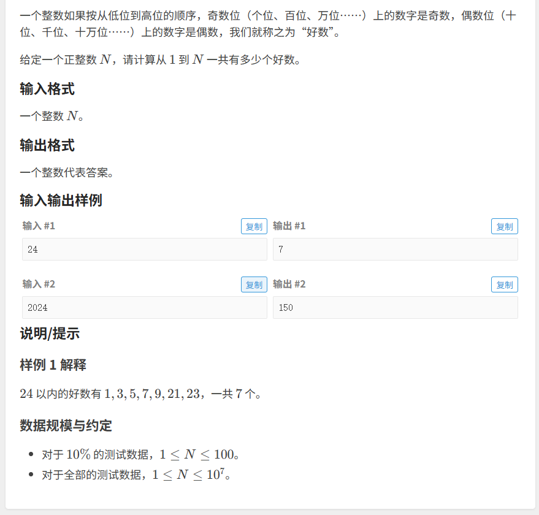

```java
import java.util.*;

public class Main{
	//	54321 可以发现 个位对应的就是1 奇数,而十位是2 偶数,百位 3 奇数,以此类推,那么只需要设定一个变量a,每次都只需要让
  //这个数位数字对2取余和a对2取余的结果进行比较,如果不同,则不是好数,相同,则a++,num删除最后一位,进行下一次比较
    public static boolean check(int num){
        int cnt=1;
        while(num>0){
            int x=num%10;
            if(x%2!=cnt%2) return false;
            cnt++;
            num/=10;
        }
        return true;
    }
    
    public static void main(String [] args){
        Scanner sc = new Scanner(System.in);
        int N = sc.nextInt();
        int ans=0;
        for(int i=1;i<=N;i++){
            if(check(i)) ans++;
        }
        System.out.println(ans);
    }
}
```


### [自建OJ：小蓝的漆房](http://47.121.118.174/p/597)

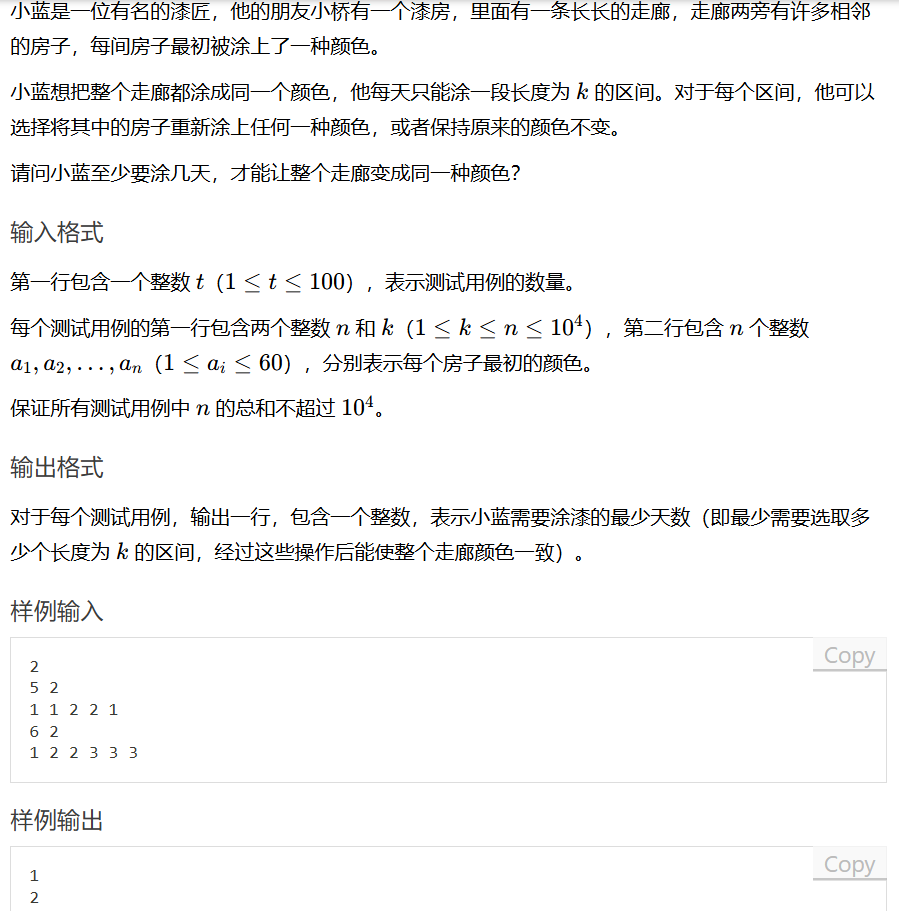


```java
import java.util.*;

public class Main{
		//一共只有60种颜色,所以可以枚举每种颜色情况,筛选出最小的情况
    public static void main(String [] args){
        Scanner sc =new Scanner(System.in);
        int t=sc.nextInt();
        for(int i=0;i<t;i++){
            int n=sc.nextInt();
            int k=sc.nextInt();
            int [] a = new int [n];
            for(int j=0;j<n;j++){
               a[j]=sc.nextInt();
            }

            //初始化完了,接下来进行遍历每种颜色需要多少天涂完
            int ans=n;
            for(int color=1;color<=60;color++){
                int cnt=0;
                for(int j=0;j<n;){
                    if(a[j]==color) j++;
                    //不相等的话 说明需要刷 则要加k
                    else {
                        j += k;
                        cnt++;
                    }
                }
                ans=Math.min(ans,cnt); //最小的即为最小的天数
            }
            System.out.println(ans);
        }
    }
}
```


### [洛谷：评委打分](https://www.luogu.com.cn/problem/P8830)

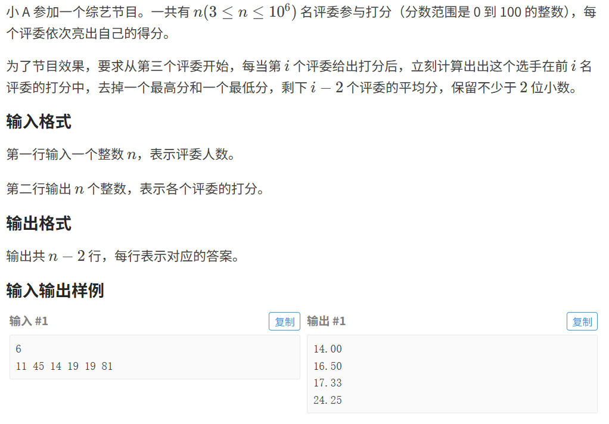

```java
import java.io.*;

public class test{

    public static void main(String [] args) throws IOException {
      //缓冲输入流和缓冲输出流 减少io
        BufferedReader br = new BufferedReader(new InputStreamReader(System.in));
        PrintWriter pw = new PrintWriter(System.out);

        int N = Integer.parseInt(br.readLine());
        String [] s = br.readLine().split(" ");

        int max = Integer.MIN_VALUE;
        int min = Integer.MAX_VALUE;
        double sum=0;

        for (int i = 0; i < N; i++) {
            int num = Integer.parseInt(s[i]);
            sum+=num;
            if(num>max)max=num;
            if(num<min) min=num;

            if (i>=2){
                double avg=(sum-min-max)/(i-1);
                pw.printf("%.2f\n",avg);
            }
        }
        pw.flush();
        pw.close();
        br.close();
    }
}
```

### [洛谷：最大正方形](https://www.luogu.com.cn/problem/P1387)

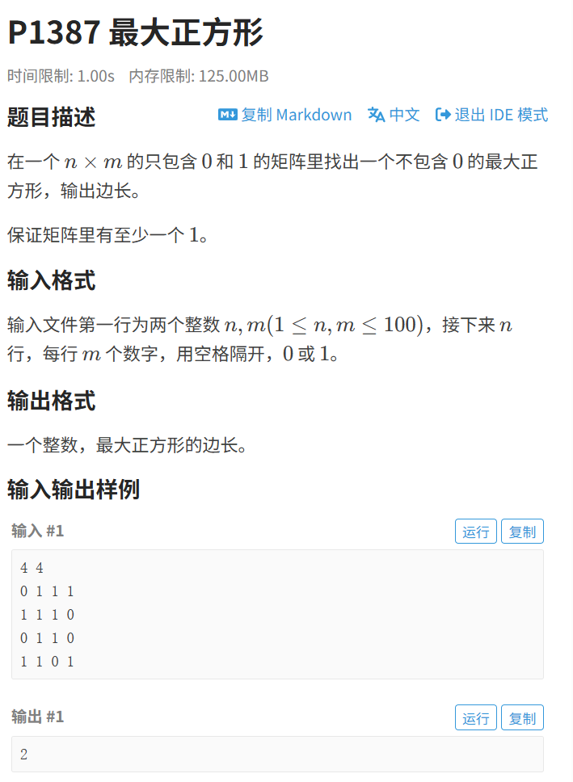

```java
import java.util.Scanner;

public class Main {
    public static void main(String[] args) {
        Scanner scanner = new Scanner(System.in);

        // 读取矩阵的行数和列数
        int n = scanner.nextInt();
        int m = scanner.nextInt();

        // 创建矩阵
        int[][] matrix = new int[n][m];
        for (int i = 0; i < n; i++) {
            for (int j = 0; j < m; j++) {
                matrix[i][j] = scanner.nextInt();
            }
        }
        scanner.close(); // 关闭Scanner以避免警告

        // dp[i][j] 表示以 (i,j) 为右下角的最大正方形的边长
        int[][] dp = new int[n][m];
        int maxSide = 0;

        for (int i = 0; i < n; i++) {
            for (int j = 0; j < m; j++) {
                if (matrix[i][j] == 1) {
                    if (i == 0 || j == 0) {
                        // 如果在第一行或第一列，则最大正方形边长为1
                        dp[i][j] = 1;
                    } else {
                        // 否则，状态转移方程
                        dp[i][j] = Math.min(Math.min(dp[i - 1][j], dp[i][j - 1]), dp[i - 1][j - 1]) + 1;
                    }
                    // 更新全局最大边长
                    maxSide = Math.max(maxSide, dp[i][j]);
                } else {
                    // 当前位置为0，则不可能是任何全1正方形的右下角
                    dp[i][j] = 0;
                }
            }
        }

        System.out.println(maxSide);
    }
}
```


## 2.排序:

### [自建OJ：成绩排序](http://47.121.118.174/p/354)

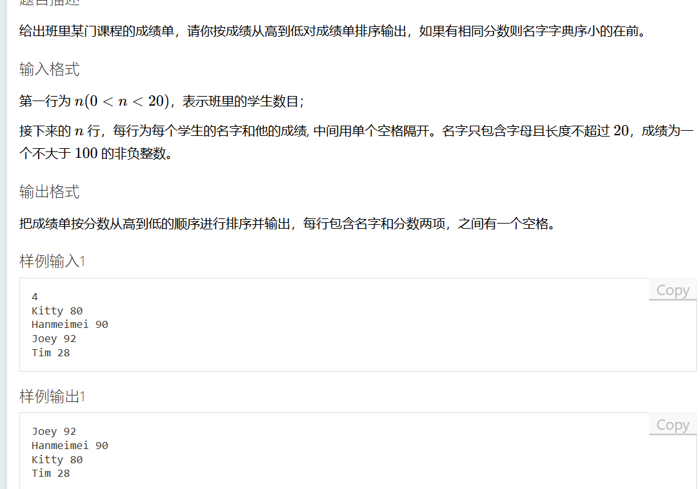

```java
import java.util.*;

public class Main{
    static class Stu{
        String name;
        int score;

        Stu(String name,int score){
            this.name=name;
            this.score=score;
        }
    }

    public static void main(String [] args){
        Scanner sc =new Scanner(System.in);

        int n =sc.nextInt();
        Stu [] stus = new Stu [n];
        for(int i=0;i<n;i++){
            String name = sc.next();
            int score = sc.nextInt();
            stus[i]=new Stu(name,score);
        }

        Arrays.sort(stus,(x,y)->{
            if(x.score!=y.score) return y.score-x.score;
            return x.name.compareTo(y.name);
        });

        for(Stu s:stus) System.out.println(s.name+" "+s.score);
    }
} 
```

### [洛谷：接水](https://www.luogu.com.cn/problem/P1223)

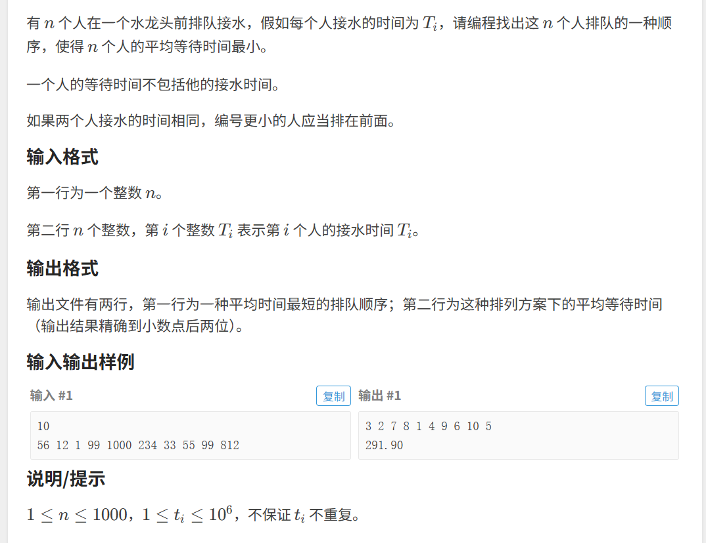

```java
import java.util.*;

public class Main{

    static class P{
        long t;
        long no;

        P(long t,long no){
            this.t=t;
            this.no=no;
        }
    }

    public static void main(String [] args){
        Scanner sc = new Scanner(System.in);
        int n = sc.nextInt();
        P [] arr = new P [n+5];
        
        // 注意：这里使用 int i，long i 会编译错误,因为数组的索引必须是int类型
        //且必须 new P() 来初始化对象
        for(int i=1;i<n+1;i++) {
            long time = sc.nextLong(); // 读取 t
            arr[i] = new P(time, i); // 创建新对象并存入数组
        }
        
        Arrays.sort(arr,1,n+1,(x,y)->{
            if(x.t!=y.t) return Long.compare(x.t, y.t);
            // 升序用Long类的比较方法,防止int类型溢出
            return Long.compare(x.no, y.no);
        });
        
        long sum = 0;
        for(int i=1;i<n;i++){
            System.out.print(arr[i].no+" ");
            sum+=(n-i)*arr[i].t;
        }
        System.out.println(arr[n].no);
        double ans =(double) sum / n;
        System.out.printf("%.2f",ans); // 修正格式符 "%..2f"不对
    }
}
```

### [洛谷：明明的随机数](https://www.luogu.com.cn/problem/P1059)

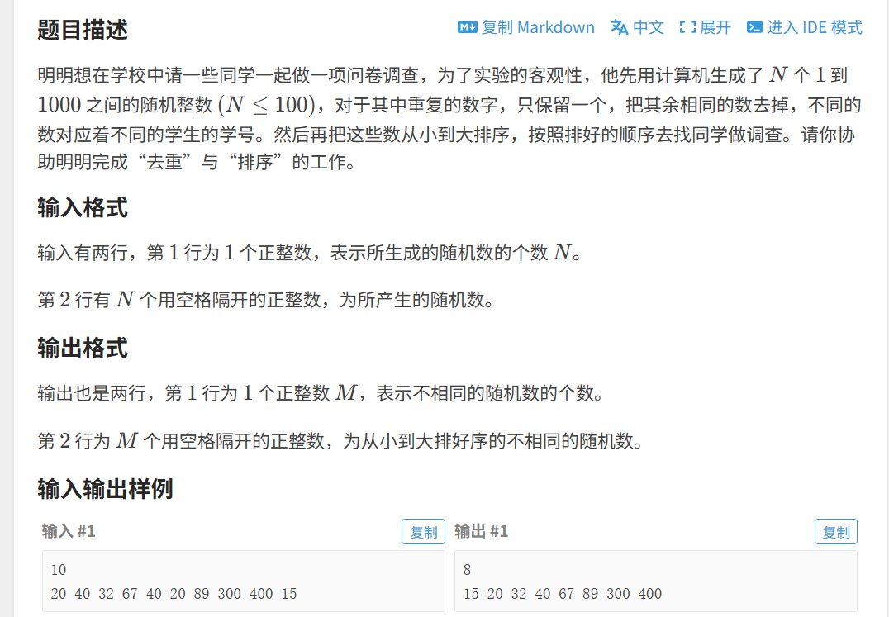

```java
import java.util.*;

public class Main{

    public static void main(String [] args){
        Scanner sc = new Scanner(System.in);
        int N = sc.nextInt();
        TreeSet<Integer> ts = new TreeSet<Integer>();

        for(int i=0;i<N;i++) {
            int temp = sc.nextInt();
            ts.add(temp);
        }

        System.out.println(ts.size());
        for(Integer e : ts){
            System.out.print(e+" ");
        }
    }
}
```


### [洛谷：三国游戏](https://www.luogu.com.cn/problem/P13887)

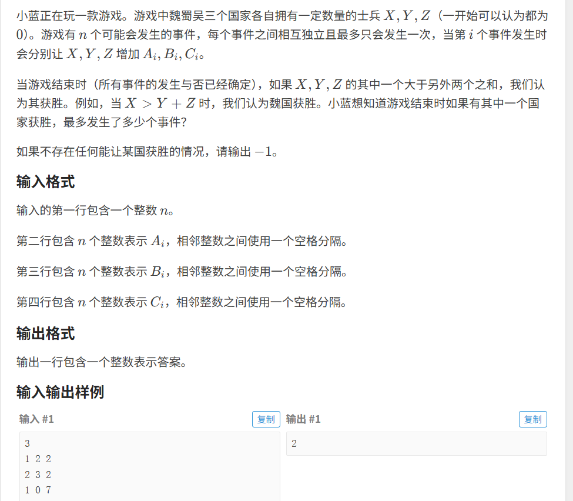

```java
import java.util.*;

public class Main {
    private static int[] a = new int[100010];
    private static int[] b = new int[100010];
    private static int[] c = new int[100010];
    private static int[] s = new int[100010]; // s为贡献值数组
    private static int n;

    
    public static void main(String[] args) {
        
        Scanner sc = new Scanner(System.in);
        n = sc.nextInt();

        for(int i=1;i<=n;i++) a[i]=sc.nextInt();
        for(int i=1;i<=n;i++) b[i]=sc.nextInt();
        for(int i=1;i<=n;i++) c[i]=sc.nextInt();

        int result = Math.max(Math.max(f(0),f(1)),f(2));
        System.out.println(result);
    }
     public static int f(int t) {
        for (int i = 1; i <= n; i++) {
            if (t == 0) { // 魏国
                s[i] = a[i] - b[i] - c[i];
            } else if (t == 1) { // 蜀国
                s[i] = b[i] - a[i] - c[i];
            } else if (t == 2) { // 吴国
                s[i] = c[i] - b[i] - a[i];
            }
        }
        // 排序。注意：Java数组是0索引的，所以我们排序从索引1开始，到n结束
        Arrays.sort(s, 1, n + 1);

        long sum = 0;
        int ans = 0;
        // 从最大值开始累加
        for (int i = n; i >= 1; i--) {
            sum += s[i]; // 累计和
            if (sum > 0) { // sum>0，代表事件有效
                ans++;
            } else { // 无效退出
                //说明即使加上了当前这个最大的贡献值，也无法让国家获胜。
                //后面的循环都是无效的了
                break;
            }
        }
        if (ans == 0) { // 不能分出胜负
            return -1;
        } else {
            return ans;
        }
    }
}
```


## 3.模拟:

### [自建OJ：唱跳与篮球](http://47.121.118.174/p/13)

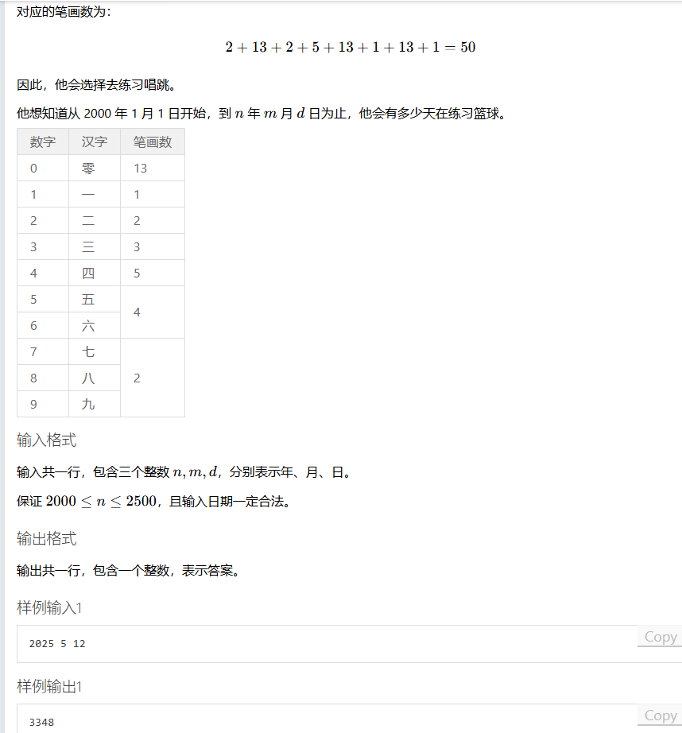

```java
import java.util.*;

public class Main{

    static int [] month={-1,31,28,31,30,31,30,31,31,30,31,30,31};
    static int [] bh={13,1,2,3,5,4,4,2,2,2};

    public static void main(String [] args){
        int cnt=0;
        Scanner sc = new Scanner(System.in);
        int y = sc.nextInt();
        int m = sc.nextInt();
        int d = sc.nextInt();

        for(int i=2000;i<=y;i++){
            if(leap(i)) month[2]=29;
            else month[2]=28;
            for(int j=1;j<=12;j++){
                for(int k=1;k<=month[j];k++){
                    int y1=i/1000;
                    int y2=i/100%10;
                    int y3=i/10%10;
                    int y4=i%10;

                    int m1=j/10%10;
                    int m2=j%10;

                    int d1=k/10%10;
                    int d2=k%10;
                    int temp=bh[y1]+bh[y2]+bh[y3]+bh[y4]+bh[m1]+bh[m2]+bh[d1]+bh[d2];
                    if(temp>50) cnt++;
                    if(i==y && j==m && k==d) {
                        System.out.print(cnt);
                        return;
                    }
                 
                }
            }
        }
    }
    public static boolean leap(int y){
        if(y%400==0 || y%100!=0 && y%4==0) return true;
        else return false;
    }
}
```

### [自建OJ：Z字形扫描](http://47.121.118.174/p/541)

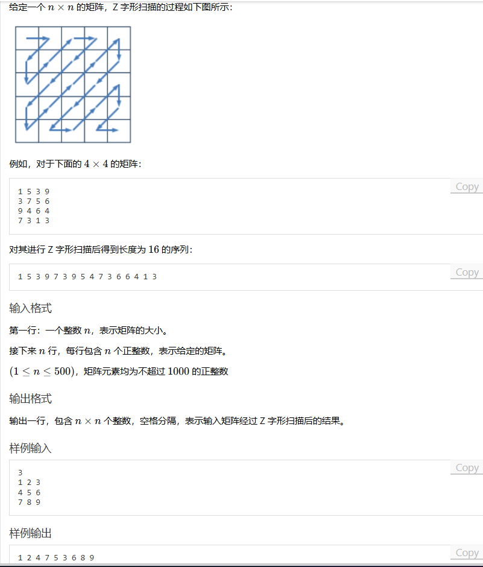

```java
import java.util.*;

public class Main {
    //这道题的 对奇数和偶数次数进行判断 分类讨论
    public static void main(String[] args) {
        Scanner sc = new Scanner(System.in);
        int n =sc.nextInt();
        int [][] arr = new int [n+5][n+5];
        for(int i=1;i<=n;i++){
            for(int j=1;j<=n;j++){
                arr[i][j]=sc.nextInt();
            }
        }
        for(int i=1;i<=2*n-1;i++){
            //扫描次数为奇数时
            if(i%2==1){
                int r=i;
                int l=1;
                for(int j=1;j<=i;j++){
                    if(r>=1 && r<=n &&l>=1 &&l<=n){
                        System.out.print(arr[r][l]+" ");
                    }
                    r--;
                    l++;
                }
            }
            else{
                int r=1;
                int l=i;
                for(int j=1;j<=i;j++){
                    if(r>=1 && r<=n &&l>=1 &&l<=n){
                        System.out.print(arr[r][l]+" ");
                    }
                    l--;
                    r++;
                }
            }
        }
    }   
}
```


### [洛谷：田忌赛马](https://www.luogu.com.cn/problem/B3928)

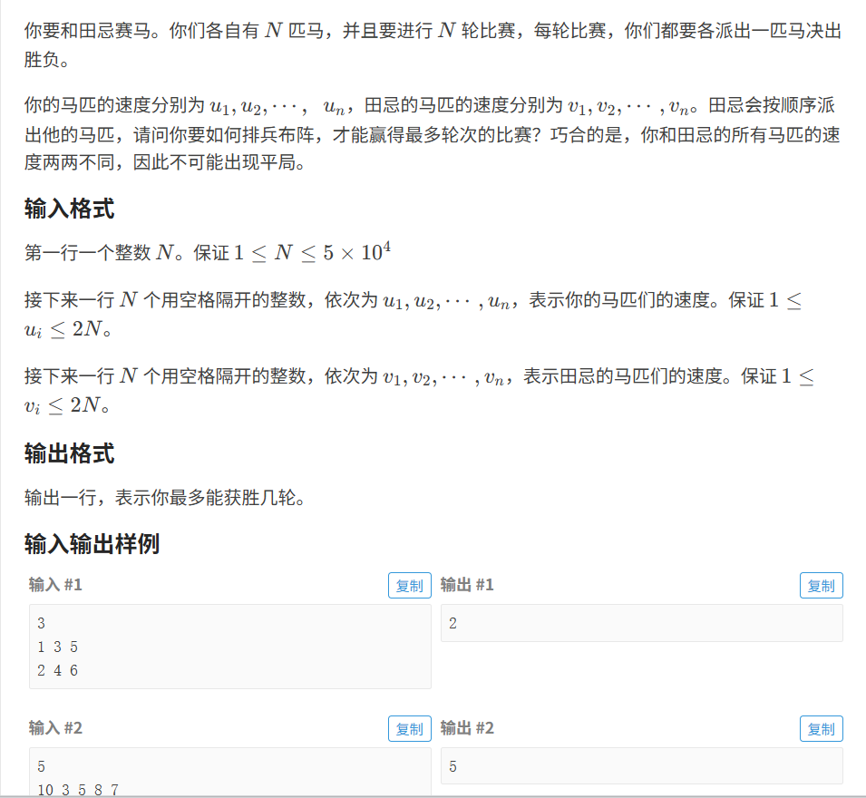

```java
import java.util.*;
//给两个序列从小到大排序，如果我们当前马还没有别人当前最慢的马快，
//那就去当炮灰。否则就去当前最慢的马那里和它对战。
//但是由于炮灰这个操作并不会造成什么影响，只需要跳过当前马就行了。
//所以可以不用执行。我们只需要执行当这个马大于田忌当前最慢的马的时候去和它对战就行了。

//总结：
//对我们和田忌的马的速度进行从小到大排序。
//用两个指针 i，j 分别代表我们的马和田忌当前最慢的马的下标。
//如果我们的第 i 个马的速度大于等于田忌第 j 个马（当前最慢的马）的速度，那么就让 j+1，ans+1。
//输出 ans，代码结束。
public class Main {

    public static void main(String[] args) {
        Scanner sc = new Scanner(System.in);
        int n = sc.nextInt();

        int [] tj= new int [n+5];
        int [] me=new int [n+5];

        for(int i=1;i<=n;i++) me[i]= sc.nextInt();
        for(int i=1;i<=n;i++) tj[i]= sc.nextInt();
        
        Arrays.sort(tj,1,n+1);
        Arrays.sort(me,1,n+1);

        int ans=0;
        for(int i=1,j=1;i<=n;i++){
            if(me[i]>tj[j]){
                ++j;
                ++ans;
            }
        }
         System.out.print(ans);
    }           
}
```


## 4.进制转换:

### [自建OJ: K 进制转 10 进制](http://47.121.118.174/p/378)

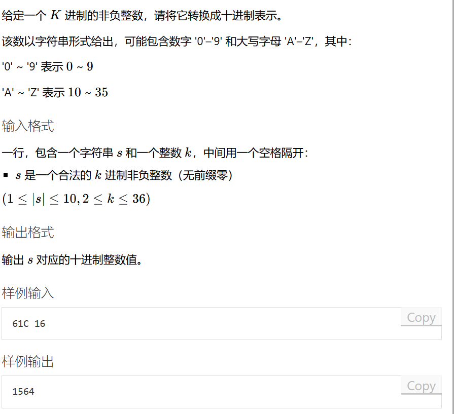

```java
import java.util.*;

public class Main{

    public static void main(String [] args){
        Scanner sc =new Scanner(System.in);
        String s = sc.next();
        int k = sc.nextInt();
        System.out.print(convertToDecimal(s,k));
    }

    public static int charToVal(char c){
        if(c>='0'&& c<='9') return c-'0';
        return c-'A'+10;
    }

    public static long convertToDecimal(String s,int k){
        long res=0;
        long base=1;
        for(int i=s.length()-1;i>=0;i--){
            res = res + charToVal(s.charAt(i))*base;
            base=base *k;
        }
        return res;
    }
}
```


### [自建OJ: 10 进制转 K 进制](http://47.121.118.174/p/377)

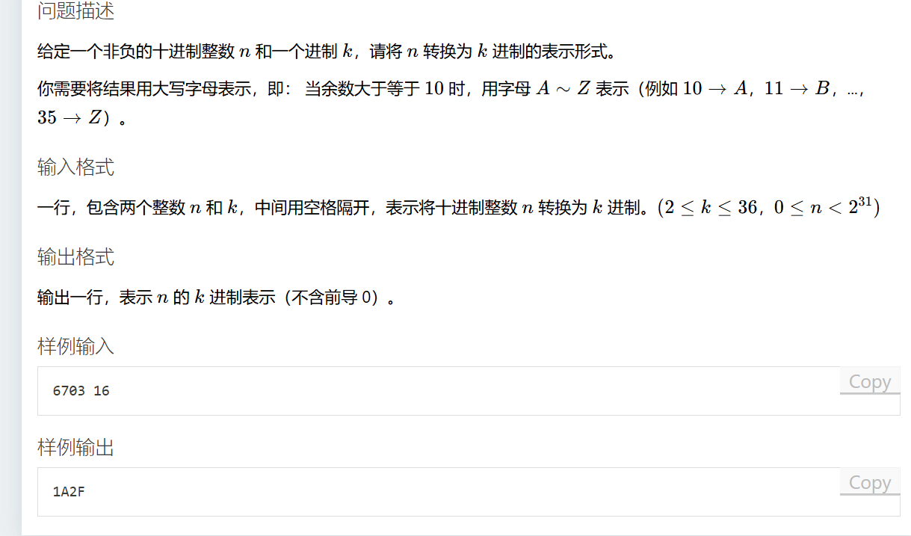

```java
import java.util.*;

public class Main{
    public static void main(String [] args){
        String s ="0123456789ABCDEFGHIJKLMNOPQRSTUVWXYZ";
        Scanner sc =new Scanner(System.in);
        int n = sc.nextInt();
        int k = sc.nextInt();
        
        String ans="";
        while(n>0){
            ans=s.charAt(n%k)+ans;
            n/=k;
        }
        System.out.print(ans);
    }
}
```


### [洛谷：进制转换](https://www.luogu.com.cn/problem/P1143)

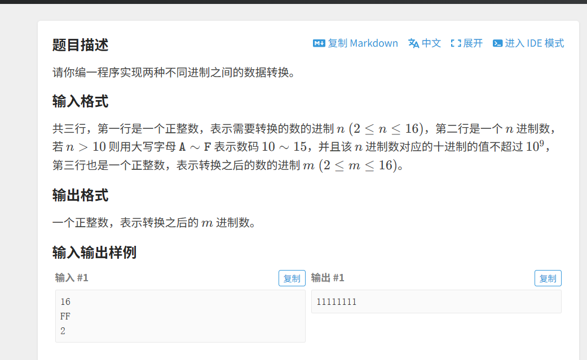

```java
import java.util.ArrayList;
import java.util.List;
import java.util.Scanner;

public class Main {
    static boolean isBaseGood(String s, int i) {
        char[] chars = s.toCharArray();
        for (char c : chars) {
            int num = 0;
            if (c >= '0' && c <= '9') {
                num = c - '0';
            } else if (c >= 'A' && c <= 'Z') {
                num = c - 'A' + 10;
            }
            if (num >= i) {
                return false;
            }
        }

        return true;
    }

    public static void main(String[] args) {
        Scanner sc = new Scanner(System.in);
        int m = sc.nextInt();

        while (m-- > 0) {
            List<Integer> set = new ArrayList<>();
            String s = sc.next();
            int n = sc.nextInt();

            for (int i : new int[] { 2, 4, 8, 16 }) {
                if (isBaseGood(s, i)) {
                    try {
                        if (Integer.parseInt(s, i) <= n) {
                            set.add(Integer.parseInt(s, i));//直接利用java自带的进制转换方法更方便
                        }
                    } catch (Exception e) {

                    }
                }
            }

            if(set.size() == 1) {
                System.out.println(set.get(0));
            }else {
                System.out.println(-1);
            }
        }
    }
}
```


## 5.位运算:

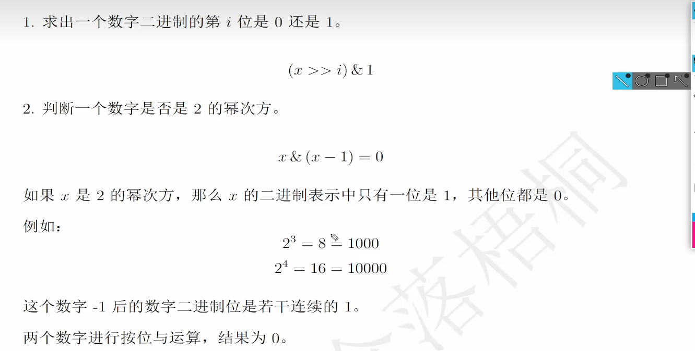

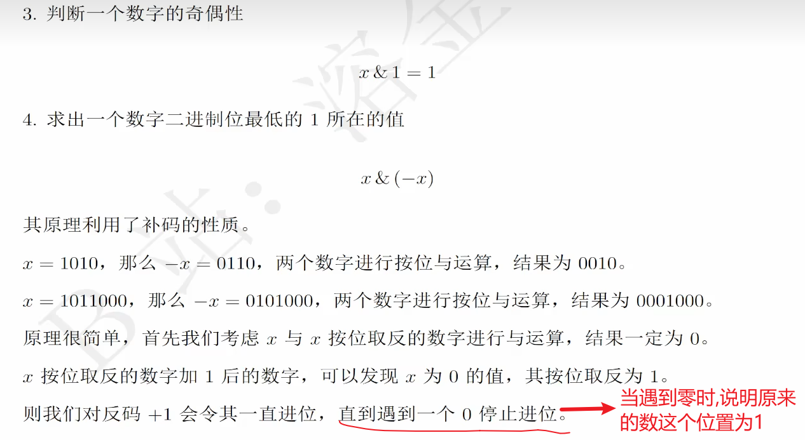

### [自建OJ：统计二进制中1的个数](http://47.121.118.174/p/50)

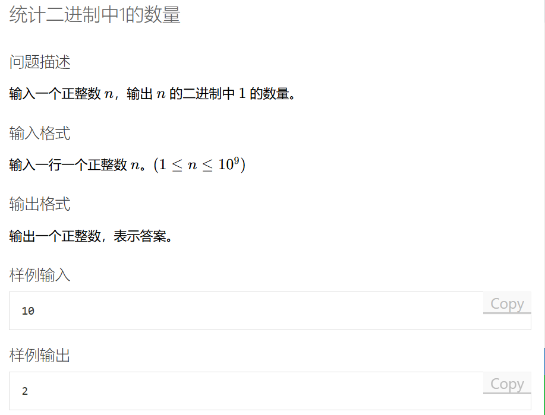

```java
import java.util.*;

public class Main{

    public static void main(String [] args){
        Scanner sc =new Scanner(System.in);
        int n = sc.nextInt();
        int ans=0;
        for(int i=0;i<=30;i++){
            if(((n>>i)&1)==1) ans++;
        }
        System.out.print(ans);
    }
}
```


### [自建OJ：位运算的操作](http://47.121.118.174/p/71)

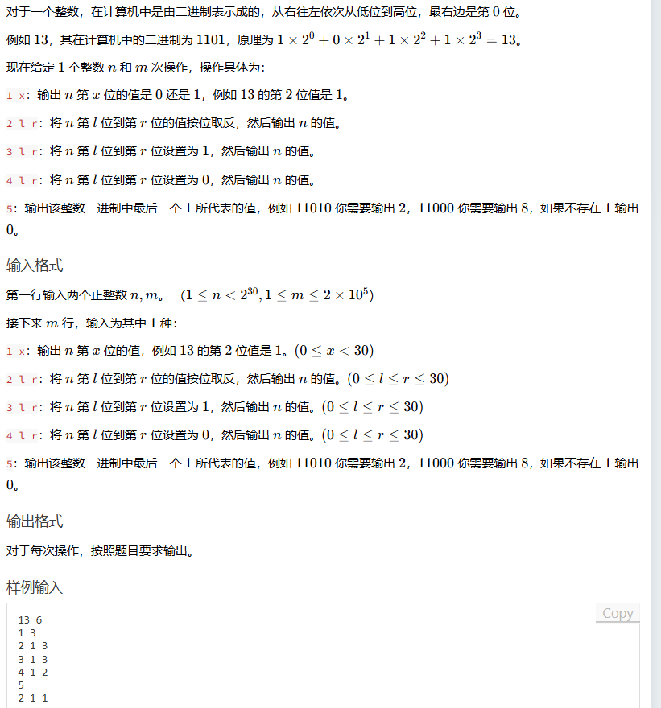

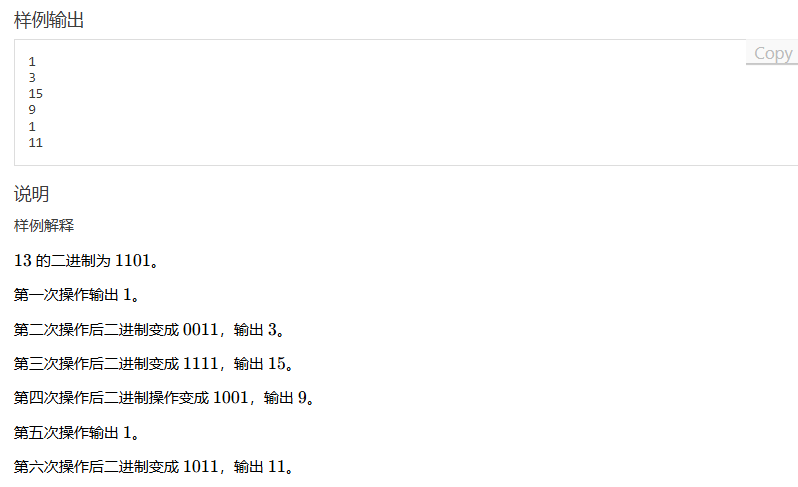

```java
import java.util.*;

public class Main{

    public static void main(String [] args){
        Scanner sc =new Scanner(System.in);
        int n= sc.nextInt();
        int m=sc.nextInt();

        while(m-->0){
            int op =sc.nextInt();
            if(op==1){
                int x=sc.nextInt();
                
                System.out.println((n>>x)&1);
            }
            else if(op==2){
                int l =sc.nextInt();
                int r=sc.nextInt();
                int temp1=(1<<(r+1))-1;
                int temp2=(1<<l)-1;
                int temp=temp1-temp2;
                n=n^temp;
                System.out.println(n);
            }
            else if(op==3){
                int l =sc.nextInt();
                int r=sc.nextInt();
                int temp1=(1<<(r+1))-1;
                int temp2=(1<<l)-1;
                int temp=temp1-temp2;
                n=n|temp;
                System.out.println(n);
            }
            else if(op==4){
                int l =sc.nextInt();
                int r=sc.nextInt();
                int temp1=(1<<(r+1))-1;
                int temp2=(1<<l)-1;
                int temp=temp1-temp2;
                n=n&(~temp);
                System.out.println(n);
            }
            else if(op==5){
                System.out.println(n&(-n));
            }
        }
    }
}
```


### [洛谷：[蓝桥杯 2025 省 Python B\] 异或和](https://www.luogu.com.cn/problem/P12177)

#### 改日再战

## 6.前缀和与差分:

### 1.一维前缀和

[自建OJ：一维前缀和](http://47.121.118.174/p/79)

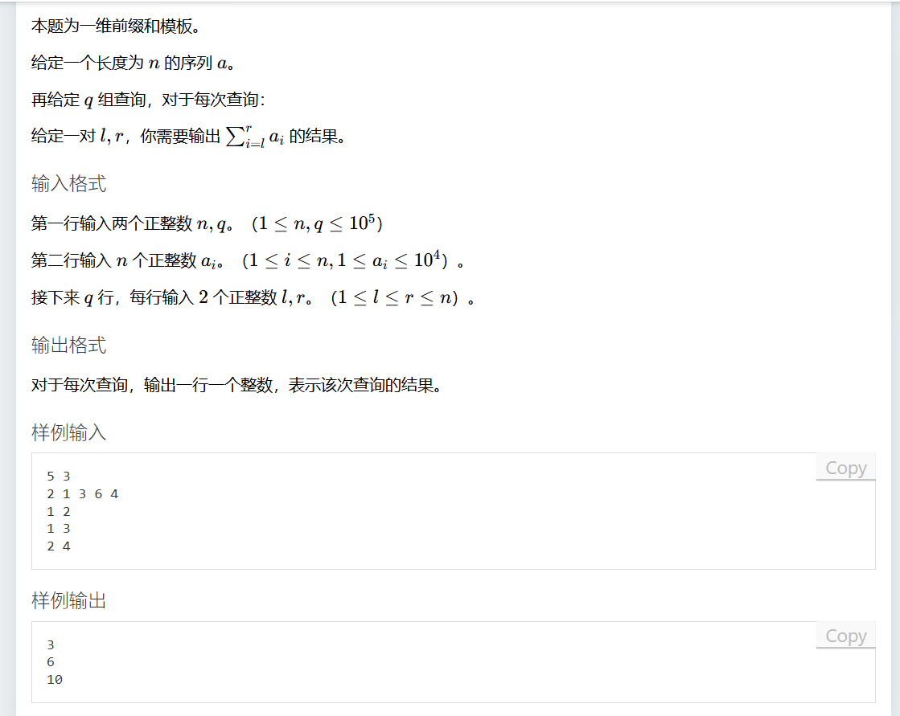

```java
import java.util.*;

public class Main{

    public static void main(String [] args){
        Scanner sc = new Scanner(System.in);
        int n=sc.nextInt();
        int q=sc.nextInt();
        int [] a=new int [n+1];
        int [] s=new int [n+1];
        s[0]=0;
        for(int i=1;i<=n;i++){
            a[i]=sc.nextInt();
            s[i]=s[i-1]+a[i];
        } 
        for(int i=1;i<=q;i++){
            int l=sc.nextInt();
            int r=sc.nextInt();
            System.out.println(s[r]-s[l-1]);
        }
    }
}
```


[自建OJ：求和](http://47.121.118.174/p/106)

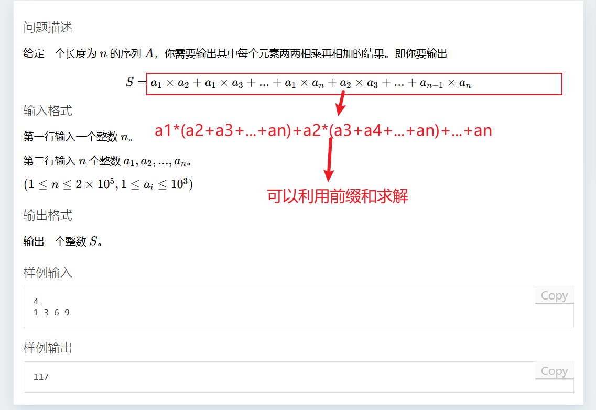

```java
import java.util.*;

public class Main{

    public static void main(String [] args ){

        Scanner sc = new Scanner (System.in);
        int n =sc.nextInt();
        long ans = 0;
        int [] arr = new int [n+1];
        int [] s =new int [n+1];
        s[0]=0;
        for(int i=1;i<=n;i++){
            arr[i]=sc.nextInt();
            s[i]=s[i-1]+arr[i];
        }
        for(int i=1;i<=n;i++){
            ans+=1l*arr[i]*(s[n]-s[i]);
        }
        System.out.print(ans);
    }
}
```


### 2.一维差分:

[自建OJ：一维差分](http://47.121.118.174/p/22)

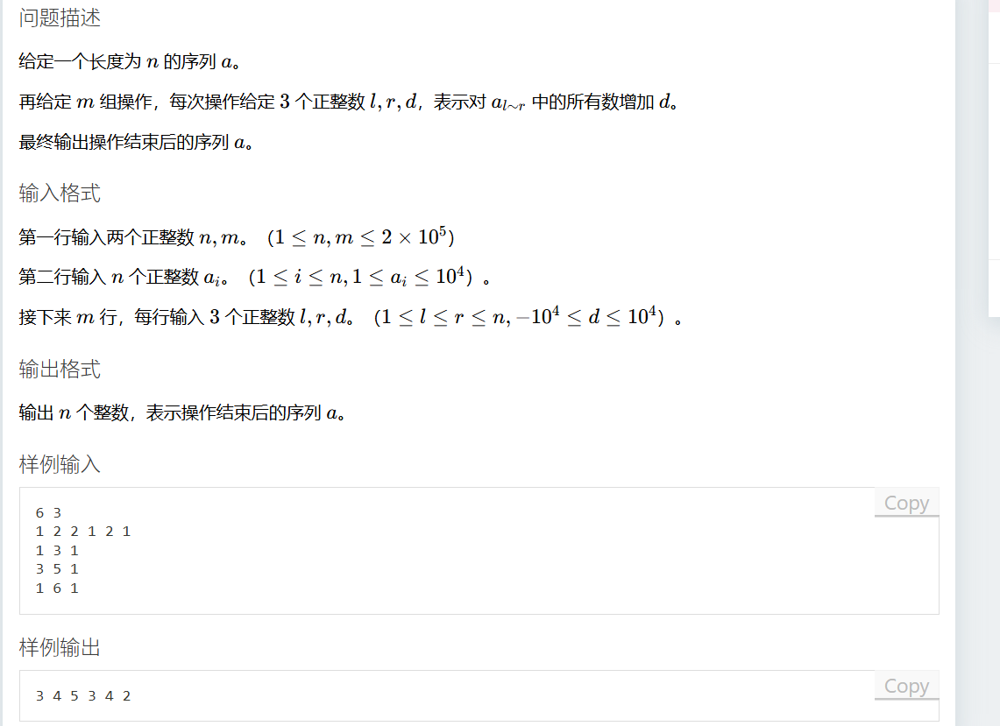

```JAVA
import java.util.*;
import java.io.*;

public class Main{  
 
    static StreamTokenizer in = new StreamTokenizer(new BufferedReader(new InputStreamReader(System.in)));

    public static int nextInt() throws IOException{
        in.nextToken();
        return (int) in.nval;
    }
    public static void main(String [] args) throws IOException{

        int n =nextInt();
        int m =nextInt();
        long [] a = new long [n+1];
        long [] D = new long [n+2];
        for(int i=1;i<=n;i++){
            a[i]=1l*nextInt();
            D[i]=a[i]-a[i-1];
        }
        for(int i=1;i<=m;i++){
            int l =nextInt();
            int r =nextInt();
            int d =nextInt();
            D[l]+=d;
            D[r+1]-=d;
        }
        //将对差分数组的操作还原成对原数组的操作     
        for(int i=1;i<=n;i++){
            a[i]=a[i-1]+D[i];
            System.out.print(a[i]+" ");
        }
    }
}
```

StreamTokenizer与BufferedReader和Scanner

https://www.qianwen.com/share/chat/4b1e3dad0c6d46469efb923517db5d2f

https://www.qianwen.com/share/chat/0651565c118e4dd4a6bd01edaab5c1b1


#### [自建OJ：最少操作次数](http://47.121.118.174/p/335)

**像这种把所有数字变成同一个数字的都可以用差分来解决**

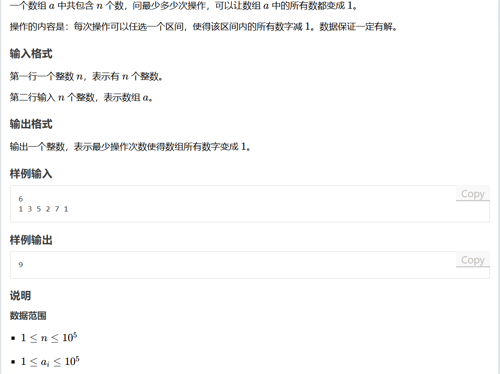

```java
import java.util.*;
import java.io.*;

public class Main{
    static StreamTokenizer in =new StreamTokenizer(new BufferedReader(new InputStreamReader(System.in)));

    public static int nextInt() throws IOException{
        in.nextToken();
        return (int) in.nval;
    } 
    public static void main(String [] args)throws IOException{

        int n =nextInt();
        int [] a =new int [n+1];
        int [] d =new int [n+1];
        for(int i=1;i<=n;i++){
            a[i]=nextInt();
            d[i]=a[i]-a[i-1];
        }
        long ans=0; //不开long会溢出int
        for(int i=1;i<=n;i++){
            if(d[i]>0) ans+=d[i];
        }
        System.out.print(ans-1);
        //记得减1,因为差分数组的第一个数最后应该为1,其他为0;
    }
}
```


### 3.二维前缀和:

#### [自建OJ：二维前缀和](http://47.121.118.174/p/42)

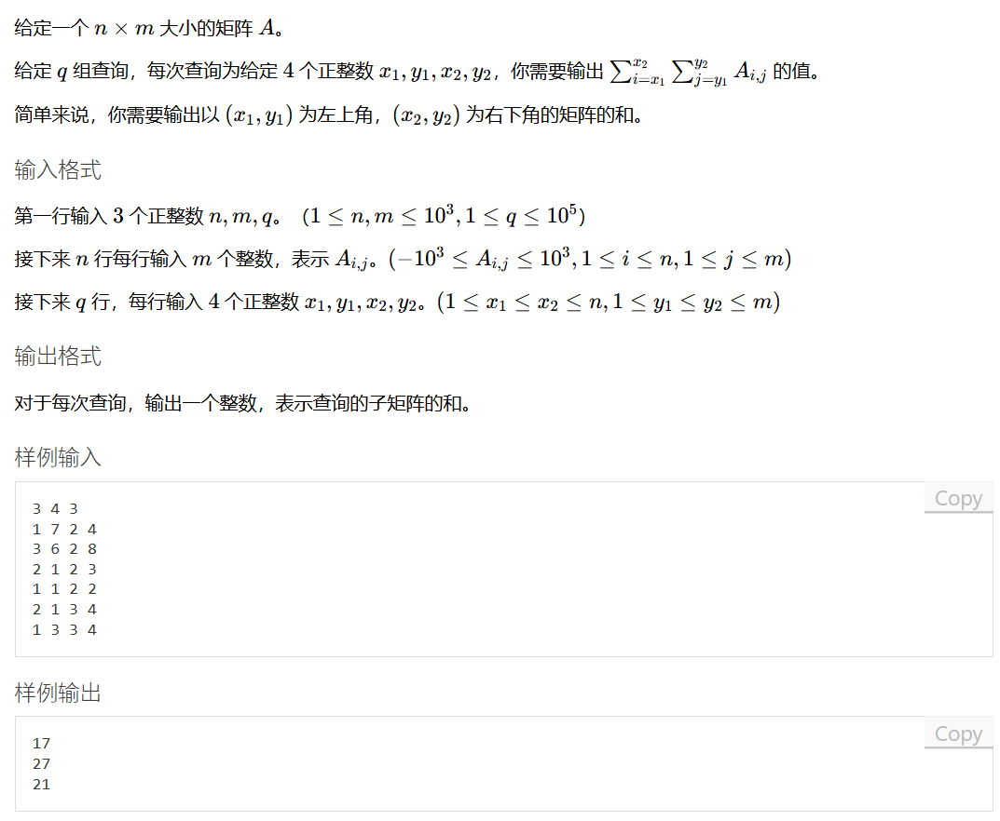

```java
import java.util.*;

public class Main{

    public static void main(String [] args){

        Scanner sc = new Scanner(System.in);
        int n = sc.nextInt();
        int m = sc.nextInt();
        int q = sc.nextInt();
        int [][] A = new int [n+5][m+5];
        int [][] S = new int [n+5][m+5];
        for(int i=1;i<=n;i++){
            for(int j=1;j<=m;j++){
                A[i][j]=sc.nextInt();
                S[i][j]=S[i-1][j]+S[i][j-1]-S[i-1][j-1]+A[i][j];
            }
        }
        for(int i=1;i<=q;i++){
            int x1=sc.nextInt();
            int y1=sc.nextInt();
            int x2=sc.nextInt();
            int y2=sc.nextInt();
            int sum=S[x2][y2]-S[x2][y1-1]-S[x1-1][y2]+S[x1-1][y1-1];
            System.out.println(sum);
        }
    }
}
```


#### [洛谷：领地选择](https://www.luogu.com.cn/problem/P2004)

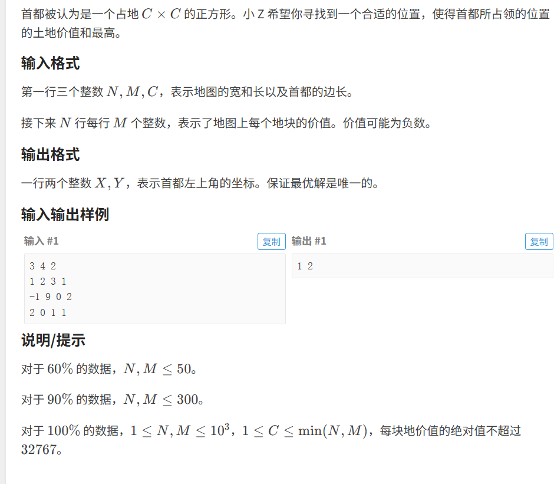

```java
import java.util.*;

public class Main{

    public static void main(String [] args){

        Scanner sc =new Scanner(System.in);
        int n=sc.nextInt();
        int m=sc.nextInt();
        int c=sc.nextInt();
      //这里原来开了个 int [][] a=new int [n+1][m+1]; 数组但是当数据量过大时会导致内存溢出
      //删了之后都是擦边过的,而且与下面的代码比较会发现,主要原因是Sacnner输入占用的空间消耗过大
        int [][] s=new int [n+1][m+1];

        for(int i=1;i<=n;i++){
            for(int j=1;j<=m;j++){
                int a=sc.nextInt();
                s[i][j]=s[i-1][j]+s[i][j-1]-s[i-1][j-1]+a;
            }
        }
        int max = Integer.MIN_VALUE;
        int x=0;
        int y=0;
        for(int i=1;i+c-1<=n;i++){
            for(int j=1;j+c-1<=m;j++){
                int x1=i;
                int y1=j;
                int x2=x1+c-1;
                int y2=y1+c-1;
                int sum=s[x2][y2]-s[x2][y1-1]-s[x1-1][y2]+s[x1-1][y1-1];
                if(sum>max){
                    max=sum;
                    x=x1;
                    y=y1;
                }
            }
        }
        System.out.print(x+" "+y);
    }
}
```

```java
// 这段代码占用的内存非常小 可以记作模板

import java.util.*;
import java.io.*;

public class Main{
	static StreamTokenizer in = new StreamTokenizer(new BufferedReader(new InputStreamReader(System.in)));
	
	public static int nextInt() throws IOException {
        in.nextToken();
        return (int) in.nval;
    }
	public static void main(String [] args) throws IOException {
		 int n,m,c;
         n = nextInt();
         m = nextInt();
         c = nextInt();
         int a[][] = new int[n+1][m+1];
         int s[][] = new int[n+1][m+1];
         for (int i=1;i<=n;i++){
             for (int j=1;j<=m;j++){
                 a[i][j] = nextInt();
                 s[i][j] = s[i-1][j] + a[i][j] + s[i][j-1] - s[i-1][j-1];
             }
         }
         int max = Integer.MIN_VALUE,x=0,y=0;
         for(int i=1;i+c-1<=n;i++){
             for(int j=1;j+c-1<=m;j++){
                 int x1=i;
                 int y1=j;
                 int x2=x1+c-1;
                 int y2=y1+c-1;
                 int sum=s[x2][y2]-s[x2][y1-1]-s[x1-1][y2]+s[x1-1][y1-1];
                 if(sum>max){
                     max=sum;
                     x=x1;
                     y=y1;
                 }
             }
         }
         System.out.println(x+" "+y);
	}
}
```

 

### 4.二维差分:

[自建OJ：二维差分](http://47.121.118.174/p/41)

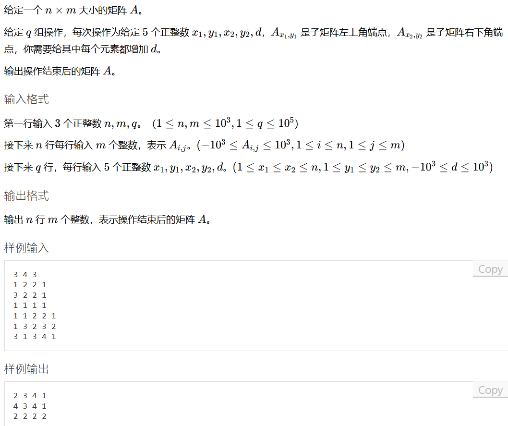

```java
import java.util.*;
import java.io.*;

public class Main{
    static StreamTokenizer in = new StreamTokenizer(new BufferedReader(new InputStreamReader(System.in)));

    public static int nextInt() throws IOException{
        in.nextToken();
        return (int) in.nval;
    }
    public static void main(String [] args) throws IOException{
        int n =nextInt();
        int m =nextInt();
        int q =nextInt();
        int [][] a =new int [n+5][m+5];
        int [][] D =new int [n+5][m+5];
        for(int i=1;i<=n;i++){
            for(int j=1;j<=m;j++){
                a[i][j]=nextInt();
                D[i][j]=a[i][j]-a[i-1][j]-a[i][j-1]+a[i-1][j-1];
            }
        }
        for(int i=1;i<=q;i++){
            int x1=nextInt(),y1=nextInt(),x2=nextInt(),y2=nextInt(),d=nextInt();
            D[x1][y1]+=d;
            D[x1][y2+1]-=d;
            D[x2+1][y1]-=d;
            D[x2+1][y2+1]+=d;
        }
        //接下来把差分数组还原成原数组
        for(int i=1;i<=n;i++){
            for(int j=1;j<=m;j++){
                a[i][j]=D[i][j] + a[i - 1][j] + a[i][j - 1] - a[i - 1][j - 1];
                System.out.print(a[i][j]+" ");
            }
            System.out.println();
        }
    }
}
```


## 7.二分


## 8.双指针:

### 左右指针:

#### [自建OJ：两数之和](http://47.121.118.174/p/54)

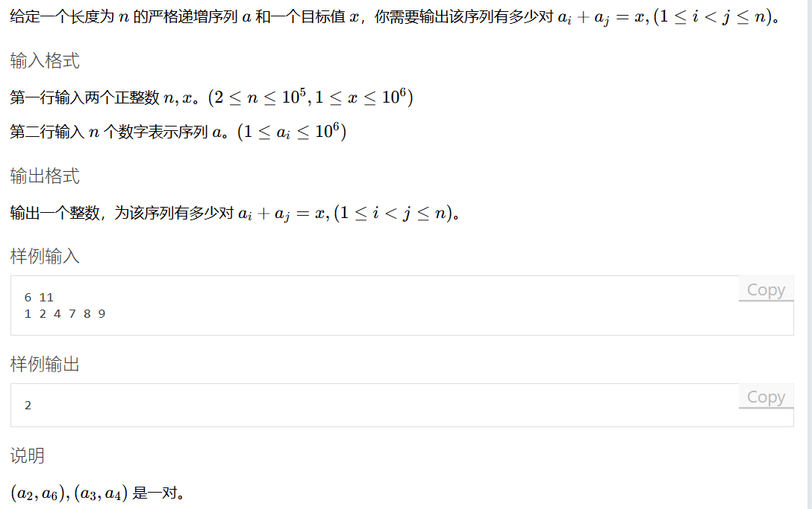

```java
import java.util.*;
import java.io.*;

public class Main{
    static StreamTokenizer in = new StreamTokenizer(new BufferedReader(new InputStreamReader(System.in)));

    public static int nextInt() throws IOException{
        in.nextToken();
        return (int) in.nval;
    }
    public static void main(String [] args) throws IOException{
        int n =nextInt();
        int x =nextInt();
        int [] a =new int [n+1];
        for(int i=1;i<=n;i++) a[i]=nextInt();
        int ans=0;
        for(int l=1,r=n;l<r;){
            long sum=1l*a[l]+a[r];
            if(sum<x)l++;
            else if(sum>x)r--;
            else{
                ans++;
                l++;
                r--;
            }
        }
        System.out.print(ans);
    }
}
```

#### [自建OJ：判断字符串是否为回文](http://47.121.118.174/p/319)

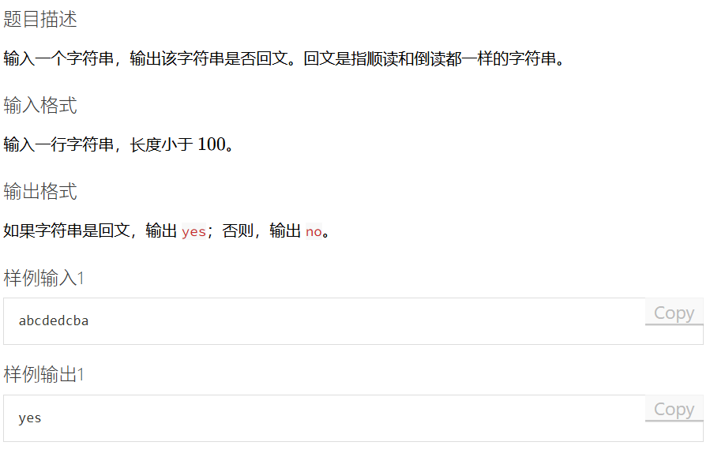

```java
import java.util.*;
import java.io.*;

public class Main{

    public static void main(String [] args){
        Scanner sc =new Scanner(System.in);
        String s = sc.next();
        for(int l=0,r=s.length()-1;l<r;){
            if(s.charAt(l)!=s.charAt(r)) {
                System.out.print("no");
                return;
            }
            r--;
            l++;
        }
        System.out.print("yes");
    }
}
```


### 快慢指针:

#### [自建OJ：和不超过S的最长序列](http://47.121.118.174/p/820)

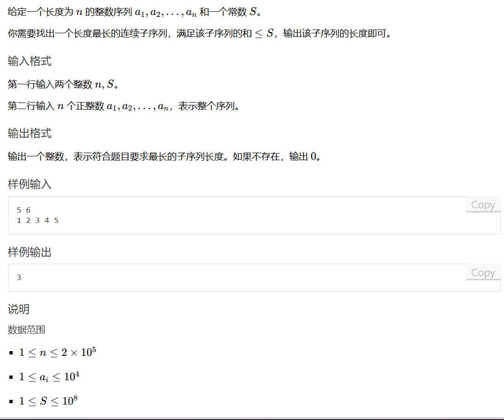

```java
import java.util.*;
import java.io.*;

public class Main{
    static StreamTokenizer in =new StreamTokenizer(new BufferedReader(new InputStreamReader(System.in)));

    public static int nextInt() throws IOException{
        in.nextToken();
        return (int) in.nval;
    }
    public static void main(String [] args) throws IOException{

        int n =nextInt();
        int S =nextInt();
        int [] a =new int [n+1];
        for(int i=1;i<=n;i++){
            a[i]=nextInt();
        }
        int ans=0;
        int sum=0;
        for(int l=1,r=0;l<=n;l++){
            
            while(r<n){
                r++;
                sum+=a[r];
                if(sum>S){
                    sum-=a[r];
                    r--;
                    break;
                }
            }
            sum-=a[l];
            ans=Math.max(ans,r-l+1);
        }
        System.out.print(ans);
    }
}
```


#### [自建OJ：无重复字符的最长子串](http://47.121.118.174/p/74)

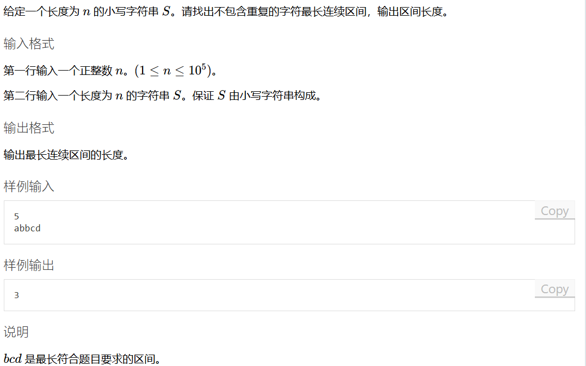

```JAVA
import java.util.*;
import java.io.*;
//利用滑动窗口来解决
public class Main{
    static int [] cnt = new int [200];
    public static void main(String [] args){
        Scanner sc =new Scanner(System.in);
        int n=sc.nextInt();
        String S=" "+sc.next();
        int maxIndex=S.length()-1; //注意数组边界判断
        int ans=0;
        for(int l=1,r=0;l<=maxIndex;l++){
            while(r<maxIndex){
                r++;
                cnt[S.charAt(r)]++;
                if(cnt[S.charAt(r)]>1){
                    cnt[S.charAt(r)]--;
                    r--;
                    break;
                }
            }
            cnt[S.charAt(l)]--;
            ans=Math.max(ans,r-l+1);
        }
        System.out.print(ans);
    }
}
```


#### [自建OJ：美丽区间](http://47.121.118.174/p/436)

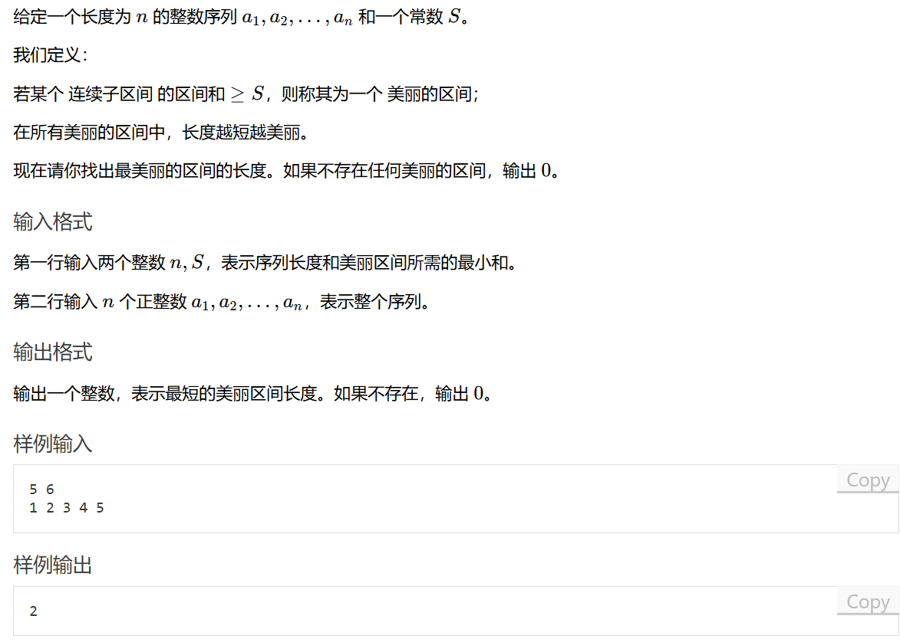

```java
import java.io.*;

//如果不大于等于S就一直右移右指针,直到sum大于等于S,然后再移动左指针,sum要减去移出窗口的值,直到sum小于S,
//然后跳出循环
public class Main {  
	public static void main(String[] args) throws IOException {
		BufferedReader br=new BufferedReader(new InputStreamReader(System.in));
        String [] str = br.readLine().split(" ");
        int n =Integer.parseInt(str[0]);
        int S =Integer.parseInt(str[1]);
        int [] a =new int [n];
        str=br.readLine().split(" ");
        for(int i=0;i<n;i++){
            a[i]=Integer.parseInt(str[i]);
        }

        int l=0;
        int min=Integer.MAX_VALUE;
        int sum=0;
        for(int r=0;r<n;r++){
            sum+=a[r];
            while(sum>=S){
                min=Math.min(min,r-l+1);
                sum-=a[l];
                l++;
            }

        }
        System.out.println(min==Integer.MAX_VALUE?0:min);
    }
}
```


# 数据结构:

## 队列:


### [自建OJ：模拟队列](http://47.121.118.174/p/57)

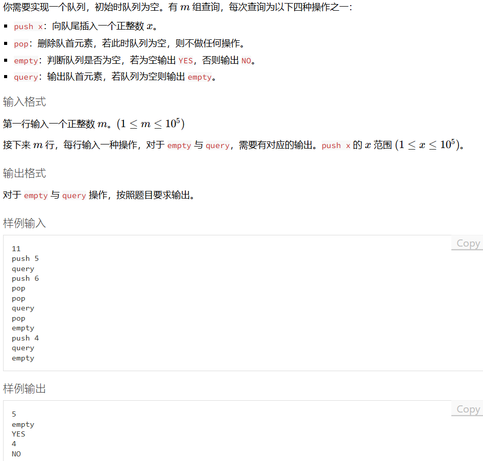

```java
import java.util.*;

public class Main{
    static int [] a =new int [1000010];

    public static void main(String [] args){
        Scanner sc =new Scanner(System.in);
        int m =sc.nextInt();
        int l=1,r=1;
        for(int i=1;i<=m;i++){
            String op=sc.next();
            if(op.equals("push")){ //这里要注意字符串的比较 不要用==
                int x=sc.nextInt();
                a[r++]=x;
            }else if(op.equals("pop")){
                if(l!=r) l++;
            }else if(op.equals("empty")){
                if(l==r) System.out.println("YES");
                else System.out.println("NO");
            }else{
                if(l!=r) System.out.println(a[l]);
                else System.out.println("empty");
            }
        }
    }
}
```


## 并查集:

并查集是解决不相交集合并问题的一种数据结构，简称为 `dsu`（disjoint set union）。

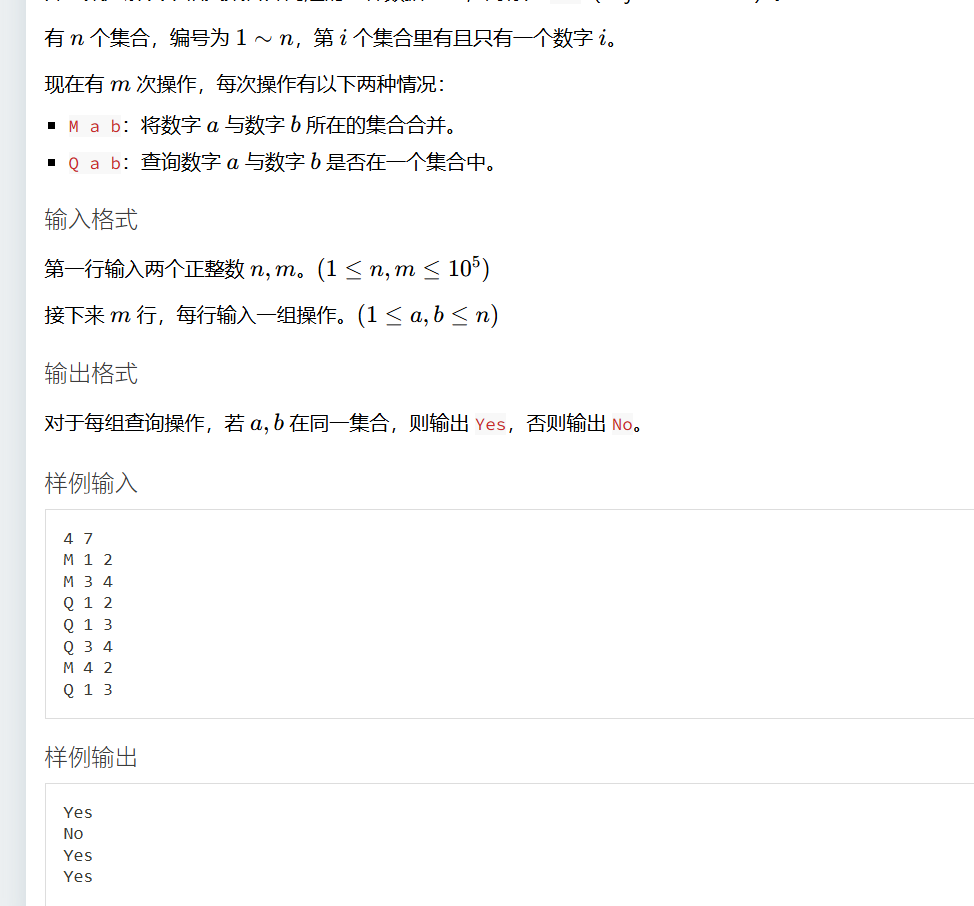

```java
import java.io.*;
import java.util.*;

public class Main{
    static final int N=100000+5;
    static int[] f=new int[N];

    public static int find(int x){
        if(x==f[x]) return x;
        return f[x]=find(f[x]);
    } 

    public static void merge(int x,int y){
        int fx=find(x);
        int fy=find(y);
        if(fx!=fy) f[fx]=f[fy];
    }
    public static boolean same(int x,int y){
        int fx=find(x);
        int fy=find(y);
        return fx==fy;
    }

    public static void main(String[] args)throws Exception{
        BufferedReader br=new BufferedReader(new InputStreamReader(System.in));
        StringTokenizer st=new StringTokenizer(br.readLine());
        int n=Integer.parseInt(st.nextToken());
        int m=Integer.parseInt(st.nextToken());

        for(int i=1;i<=n;i++) f[i]=i;

        StringBuilder sb=new StringBuilder();
        for(int i=1;i<=m;i++){
            st=new StringTokenizer(br.readLine());
            String op=st.nextToken();
            int x=Integer.parseInt(st.nextToken());
            int y=Integer.parseInt(st.nextToken());
            if(op.equals("M")) merge(x,y);
            else System.out.println(same(x,y)?"Yes":"No");
        }
    }
}
```


# 基础搜索:


## 全排列:

### [自建OJ：递归实现排列型枚举](http://47.121.118.174/p/64)

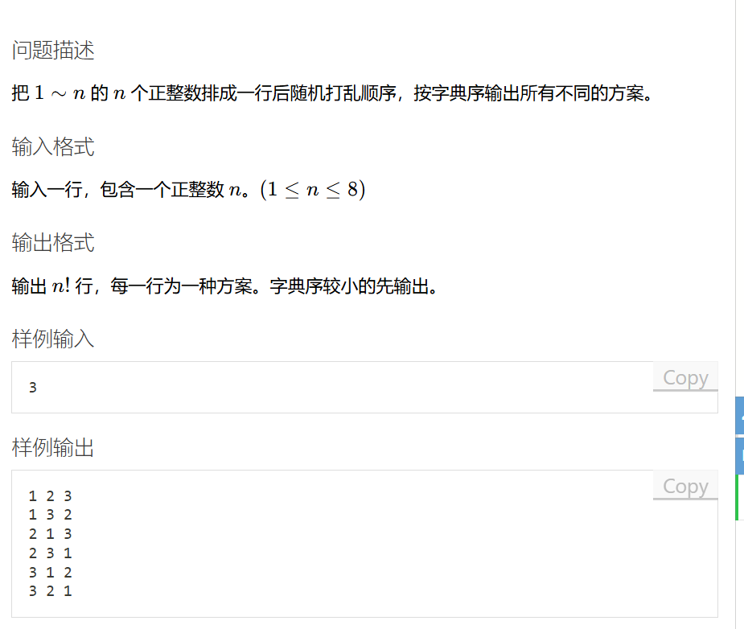

```java
import java.util.*;

public class Main{
    static int [] nums=new int [20];
    static boolean [] st=new boolean[20];
    static int n;
    public static void dfs(int u){
        if(u==n+1){
            //排列完成 输出数据
            for(int i=1;i<=n;i++){
                System.out.print(nums[i]+" ");
            }
            System.out.println();
        }
        else {
        	for(int i=1;i<=n;i++){
                if(st[i]) continue;
                st[i]=true;
                nums[u]=i;
                dfs(u+1);
                st[i]=false;
            }
        }
        

    }
    public static void main(String [] args){
        Scanner sc =new Scanner(System.in);
        n=sc.nextInt();
        dfs(1);
    }
}
```

### [洛谷：带分数](https://www.luogu.com.cn/problem/P8599)

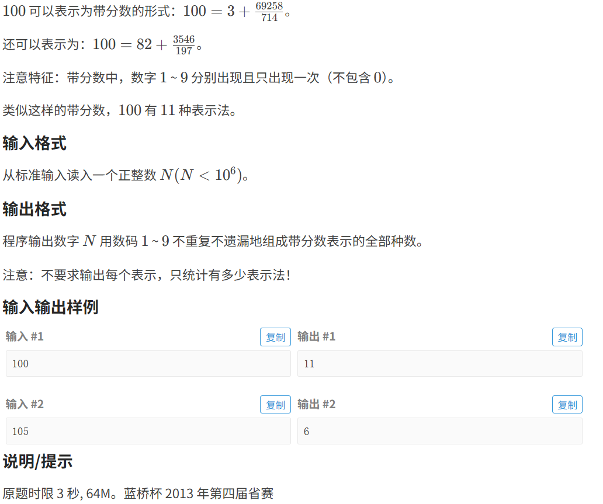

```java
import java.util.*;
import java.io.*;
//这个算法的思想是,先进行全排列,每次排列完成后,对这个排列进行遍历
//把这个排列用两个板子分成三份,分别代表a,b,c N==a+b/c,但是由于除法准度有限制 所以改成乘法 N*c==a*c+b;
public class Main{
    static int N;
    static int cnt=0;
    static int [] nums=new int [20];
    static boolean [] st=new boolean [20];

    public static long cal(int L,int R){
        long res=0;
        for(int i=L;i<=R;i++){
            res=res*10+nums[i];
        }
        return res;
    }
    
    public static void dfs(int u){//u表示第几个数字
        if(u==10){
            //循环结束 凑齐了9个数字了 开始判断是否符合条件
            for(int i=1;i<=7;i++){ //这里确实要遍历到7,只遍历到2的话,我只考虑了100的情况,N是在10e6之内的
                for(int j=i+1;j<=8;j++){
                        long a=cal(1,i);
                        long b=cal(i+1,j);
                        long c=cal(j+1,9);
                        if(1l*N*c==a*c+b){
                            cnt++;
                        
                    }
                }
            }
            return;
        }
        else{
            for(int i=1;i<=9;i++){
                if(st[i]) continue;
                st[i]=true;
                nums[u]=i;
                dfs(u+1);
                st[i]=false;
            }
        }
    }
    public static void main(String [] args){
        Scanner sc=new Scanner (System.in);
         N=sc.nextInt();
         dfs(1);
        System.out.print(cnt);
        sc.close();
    }
}
```


## 子集枚举:

### [自建OJ：递归实现指数型枚举](http://47.121.118.174/p/35)

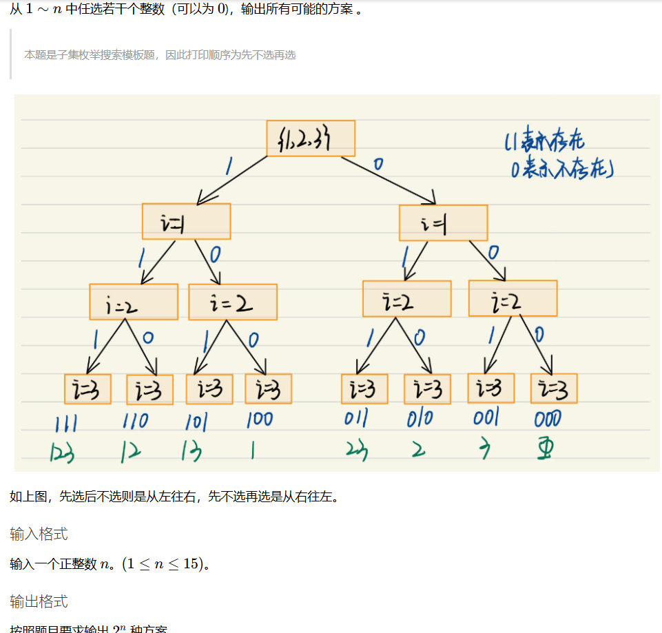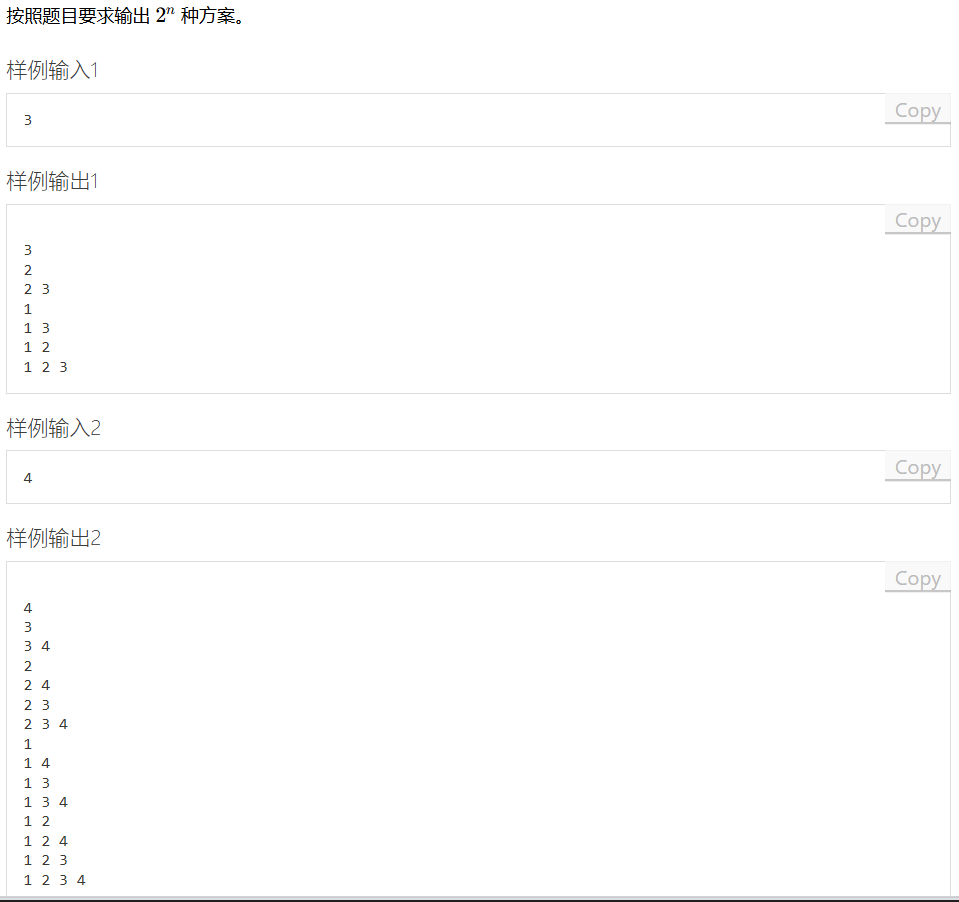

```java
import java.util.*;
import java.io.*;

public class Main{
	static int [] nums =new int [20];
	static boolean [] st=new boolean [20];
	static int n;
    
    public static void dfs(int u){//u表示第几个数字
       if(u==n+1) {
    	   for(int i=1;i<=n;i++) {
    		   if(st[i]) System.out.print(i+" ");
    	   }
    	   System.out.println();
       }
       else {
    	   for(int i=0;i<=1;i++) {
    		   if(i==0) st[u]=false;
    		   else st[u]=true;
    		   dfs(u+1);
    	   }
       }
    }
    public static void main(String [] args){
        Scanner sc=new Scanner (System.in);
         n=sc.nextInt();
         dfs(1);

        sc.close();
    }
}
```

### [自建OJ：删数游戏](http://47.121.118.174/p/128)

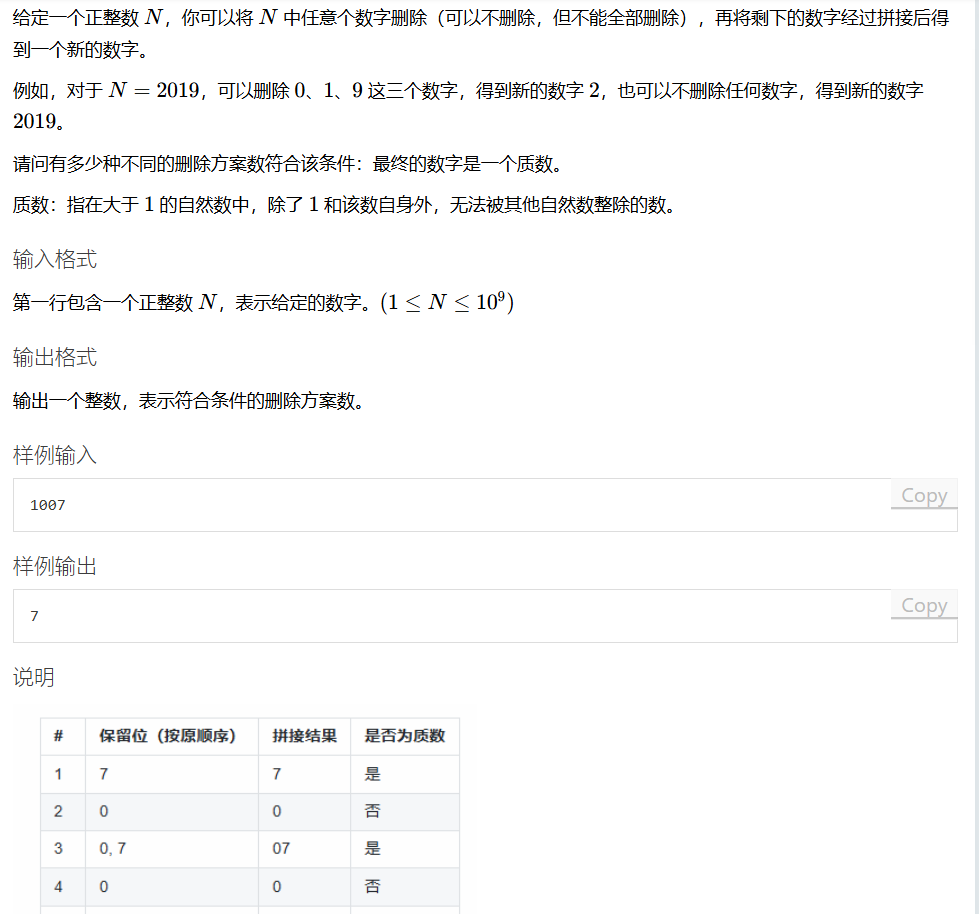

```java
import java.util.*;
import java.io.*;

public class Main{
	static int [] nums =new int [20];
	static boolean [] st=new boolean [20];
	static int n,m;
	static int ans=0;
    static String s;
    
    public static boolean IsPrime(int x) {
    	if(x<2) return false;
    	for(int i=2;i*i<=x;i++) {
    		if(x%i==0) return false;
    	}
    	return true;
    }
    
    public static void dfs(int u){//u表示第几个数字
    	if(u==m+1) {
    		int res =0;
    		for(int i=1;i<=m;i++) {
    			if(st[i]) {
    				res=res*10+s.charAt(i)-'0';
    			}
    		}
    		if(IsPrime(res)) ans++;
    	}
    	else {
    		for(int i=0;i<=1;i++) {
    			if(i==0) st[u]=false;
    			else st[u]=true;
    			dfs(u+1);
    		}
    	}
    }
   
    public static void main(String [] args){
        Scanner sc=new Scanner (System.in);
         n=sc.nextInt();
         s=" "+String.valueOf(n);
         m=s.length()-1;
         dfs(1);
         System.out.print(ans);
        sc.close();
    }
}
```


## 组合枚举:

### [自建OJ：递归实现组合型枚举](http://47.121.118.174/p/34)

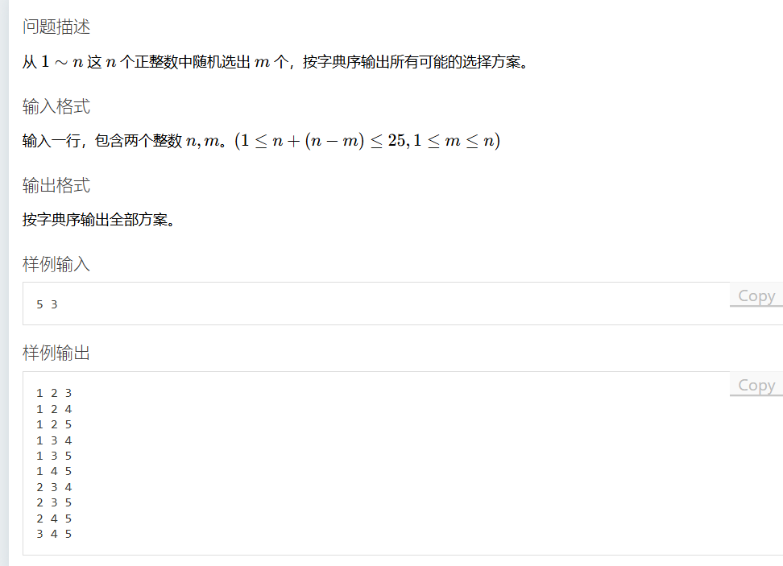

```java
import java.util.*;
import java.io.*;
//这是一个组合数问题 从n个中选出m个 
public class Main{
	static int [] nums =new int [30];
	static boolean [] st=new boolean [30];
	static int n,m;


    
    public static void dfs(int u,int start){//u表示第几个数字
    	if(u==m+1) {
    		for(int i=1;i<=m;i++) {
    			System.out.print(nums[i]+" ");
    		}
    		System.out.println();
    		return;
    	}
    	else {
    		for(int i=start;i<=n;i++) {
    			nums[u]=i;
    			dfs(u+1,i+1);
    		}
    	}
    }
   
    public static void main(String [] args){
        Scanner sc=new Scanner (System.in);
         n=sc.nextInt();  
         m=sc.nextInt();
         dfs(1,1);
        sc.close();
    }
}
```

### [自建OJ：选数](http://47.121.118.174/p/139)

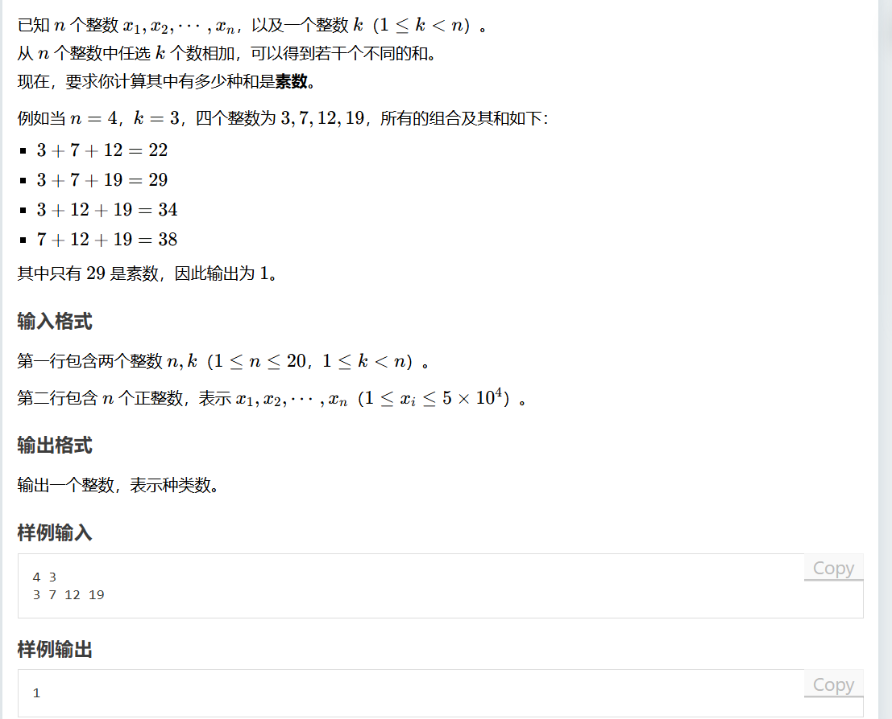\

```java
import java.util.*;
import java.io.*;

public class Main{
	static int [] nums =new int [30];
	static boolean [] st=new boolean [30];
	static int [] arr =new int [30];
	static int n,k;
	static int ans=0;
	
	static StreamTokenizer in =new StreamTokenizer(new BufferedReader(new InputStreamReader(System.in)));
	public static int nextInt() throws IOException{
		in.nextToken();
		return (int) in.nval;
	}
	
	public static boolean isPrime(int x) {
		if(x<2) return false;
		for(int i=2;i*i<=x;i++) {
			if(x%i==0) return false;
		}
		return true;
	}
    
    public static void dfs(int u,int start){//u表示第几个数字
    	if(u==k+1) {
    		int sum=0;
    		for(int i=1;i<=k;i++) {
    			sum+=nums[i];
    		}
    		if(isPrime(sum)) ans++;
    	}
    	else {
    		for(int i=start;i<=n;i++) {
    			nums[u]=arr[i];
    			dfs(u+1,i+1);
    		}
    	}
    }
   
    public static void main(String [] args) throws IOException{
        n=nextInt();
        k=nextInt();
        for(int i=1;i<=n;i++) {
        	arr[i]=nextInt();
        }
        dfs(1,1);
        System.out.print(ans);
    }
}
```


# 基础动态规划:

## 记忆化搜索:

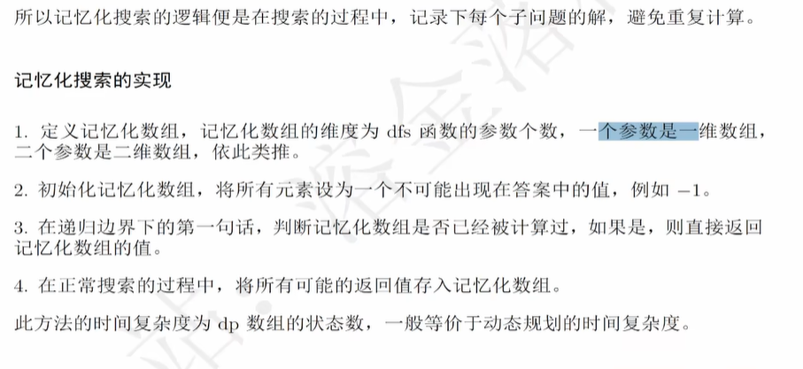

### [自建OJ：斐波拉契数列](http://47.121.118.174/p/826)

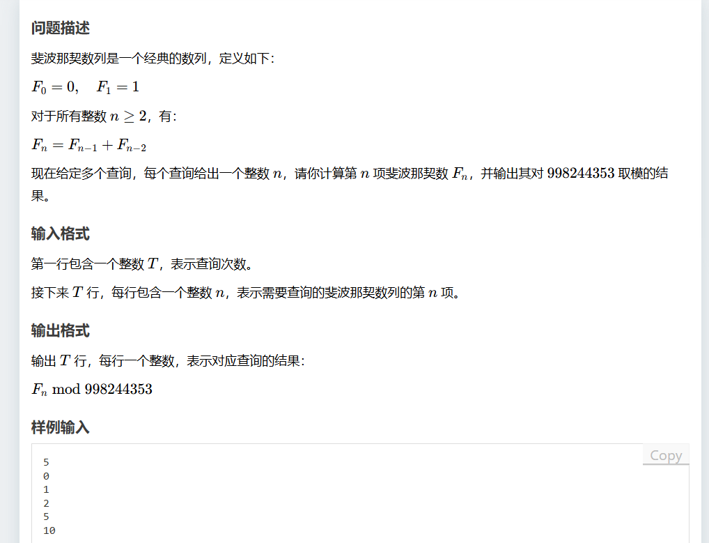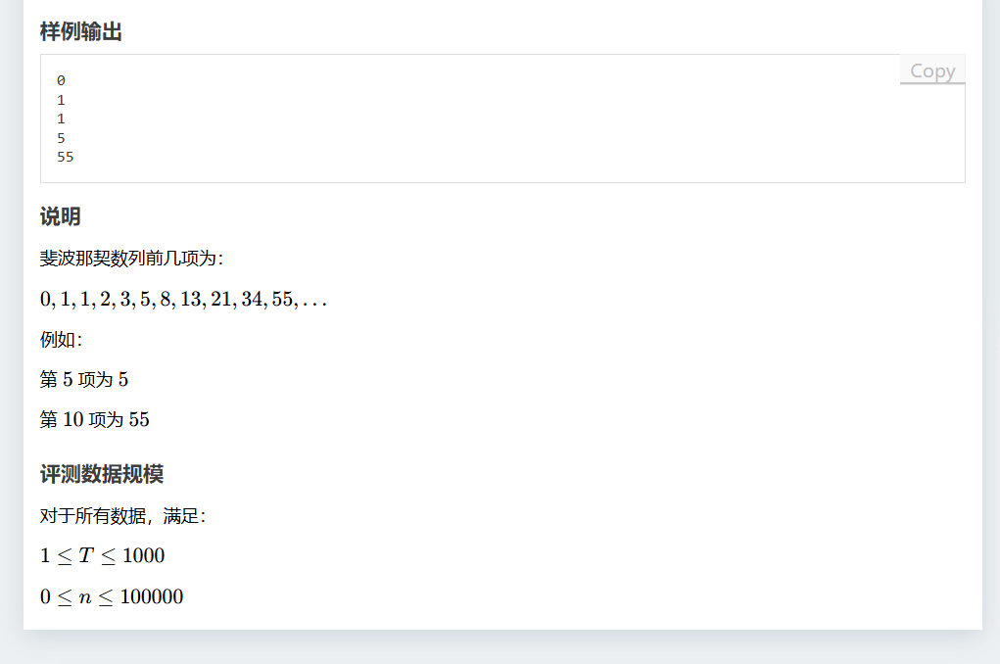

```java
import java.util.*;
import java.io.*;

public class Main{
    static final int MOD=998244353;
    static final int N=100010;

    static int [] dp=new int [N];

    public static int f(int x){
        if(x==0)return 0;
        if(x==1) return 1;
        if(dp[x]!=-1) return dp[x];
        return dp[x]=(f(x-1)+f(x-2))%MOD;
    }

    static StreamTokenizer in =new StreamTokenizer(new BufferedReader(new InputStreamReader(System.in)));
    public static int nextInt() throws IOException{
        in.nextToken();
        return (int) in.nval;
    }

    public static void main(String [] args )throws IOException{
        int T=nextInt();
        Arrays.fill(dp,-1);
        for(int i=1;i<=T;i++){
            int n=nextInt();
            System.out.println(f(n));
        }

    }
}
```

