蓝桥杯题单

[括号序列](https://ac.nowcoder.com/acm/contest/132303/D)

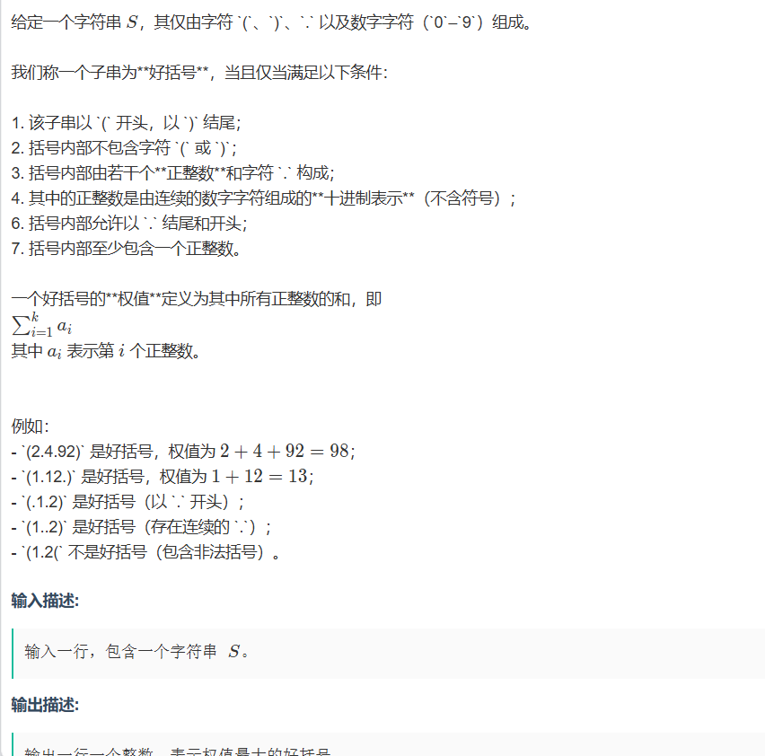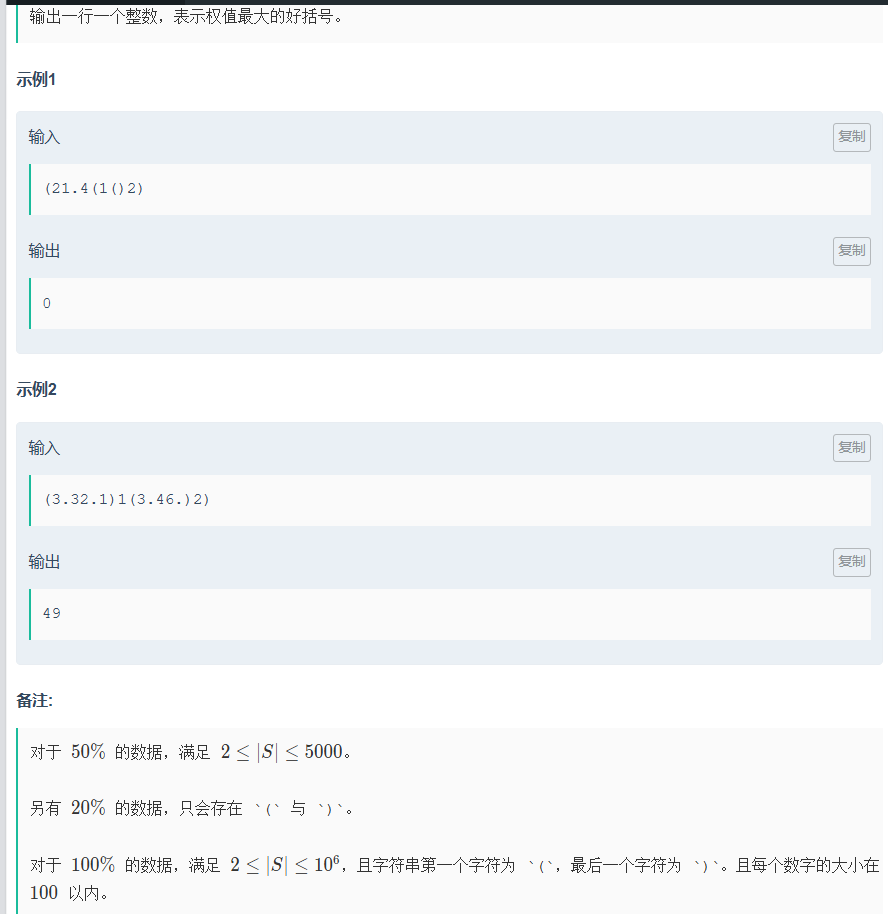

```java
import java.util.*;

public class Main {

    public static void main(String[] args){
        Scanner sc=new Scanner(System.in);

        String s=sc.next();

        boolean f=false;
        int ans=0;
        int num=0;
        int sum=0;

        for(int i=0;i<s.length();i++){
            char ch=s.charAt(i);

            if(ch=='('){
                f=true;
                num=0;
                sum=0;
            }else if(ch==')'){
                if(f){
                    sum+=num;  //这里题解漏了这个却还是正确了,正确的需要加上这句
                    ans=Math.max(ans,sum);
                }
                sum=0;
                num=0;
                f=false;
            }else if(ch=='.'){
                sum+=num;
                num=0;
            }else{
                num=num*10+(ch-'0');
            }
        }

        System.out.print(ans);
    }
}
```


# 第一周

## day01 整数与同余:


### [洛谷：计算星期几](https://www.luogu.com.cn/problem/B2074)

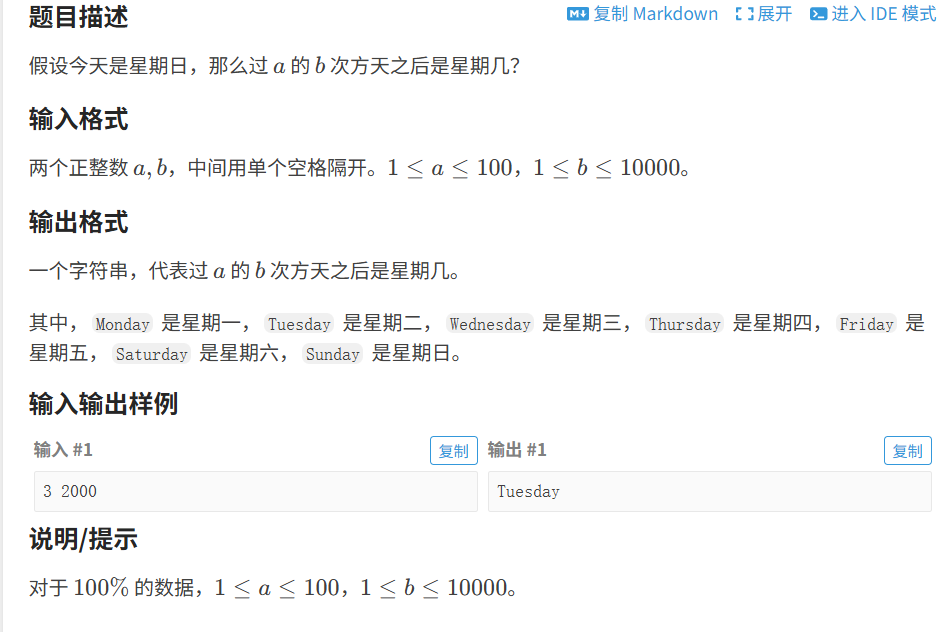

```java
import java.util.*;

public class Main{

    public static void main(String [] args){
        Scanner sc =new Scanner(System.in);
        int a= sc.nextInt();
        int b=sc.nextInt();
        int ans=1;
        for(int i=1;i<=b;i++){
          //这里要边乘边取模 可以更快 而且也避免了数过于大
            ans=ans*a%7;
        }
        switch(ans){
            case 0 : System.out.print("Sunday");break;
            case 1 : System.out.print("Monday");break;
            case 2 : System.out.print("Tuesday");break;
            case 3 : System.out.print("Wednesday");break;
            case 4 : System.out.print("Thursday");break;
            case 5 : System.out.print("Friday");break;
            case 6 : System.out.print("Saturday");break;
                
        }
    }
}
```


### [洛谷：阶乘求和](https://www.luogu.com.cn/problem/P12323)

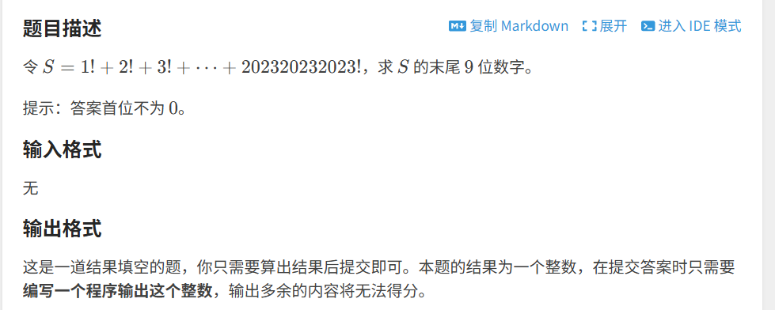

```java
import java.util.*;
//每个因数5可以和2组成一个10,使得这个数末尾增添一个0,因为最后只取9位,所以当末尾的零大于等于9时,就没有计算意义了
//40!恰好是 第一个有9个零在末尾的 所以只需要计算前39个阶乘的和求阶乘 
public class Main{
    static final long MOD=1000000000l;

    public static long jc(int n){
        long res=1;
        for(int i=1;i<=n;i++){
            res=res*i%MOD;//39!会溢出long 所以要边乘边取模
        }
        return res;
    }
    
    public static void main(String [] args){
        int n=39;
        long sum=0;
        for(int i=1;i<=n;i++){
            sum=(sum+jc(i))%MOD;
        }
        System.out.print(sum);
    }
}
```

### [洛谷：星期计算](https://www.luogu.com.cn/problem/P13928)

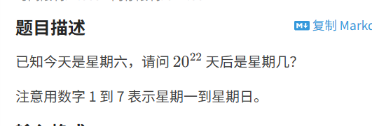

```java
import java.util.*;

public class Main{

    public static void main(String [] args){       
        int ans=1;
        for(int i=1;i<=22;i++){
          //这里要边乘边取模 可以更快 而且也避免了数过于大
            ans=ans*20%7;
        }
        switch(ans){
            case 1 : System.out.print(7);break;
            case 2 : System.out.print(1);break;
            case 3 : System.out.print(2);break;
            case 4 : System.out.print(3);break;
            case 5 : System.out.print(4);break;
            case 6 : System.out.print(5);break;
            case 0 : System.out.print(6);break;
                
        }
    }
}
```

[洛谷：传染病](https://www.luogu.com.cn/problem/B3944)

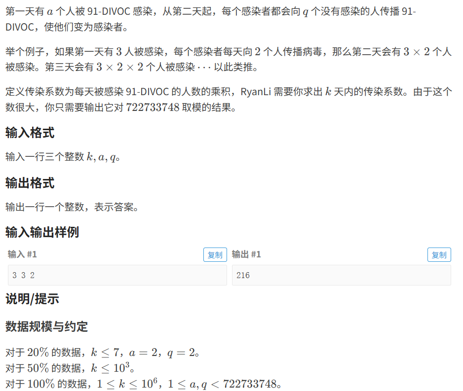

```java
import java.util.*;

public class Main{
    static final long MOD=722733748;
    public static void main(String [] args){       
        Scanner sc= new Scanner(System.in);
        int k=sc.nextInt();
        long a=sc.nextLong();
        long q=sc.nextLong();
        long sum=a;
        long count=a;
        for(int i=1;i<k;i++){
            count=count*q%MOD;
            sum=sum*count%MOD;
        }
        System.out.print(sum);
    }
}
```


## day02 约数与素数:

### [洛谷：求正整数 2 和 n 之间的完全数](https://www.luogu.com.cn/problem/B2127)

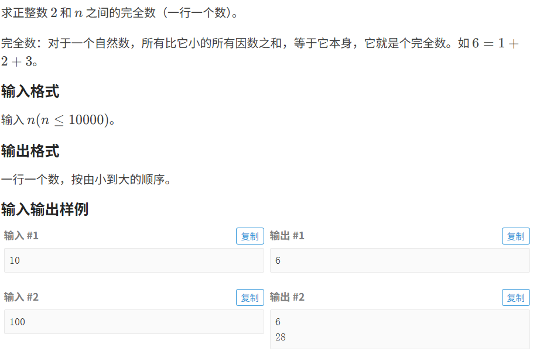

```java
import java.util.*;

public class Main{

    public static void main(String [] args){
        Scanner sc =new Scanner(System.in);
        int n=sc.nextInt();
        for(int i=2;i<=n;i++){
            int sum=0;
            for(int j=1;j<i;j++){
                if(i%j==0){
                    sum+=j;
                }
                if(sum>i) break;
            }
            if(sum==i) System.out.println(sum);
        }
        
    }
}
```

### [洛谷：素数个数](https://www.luogu.com.cn/problem/B2128)

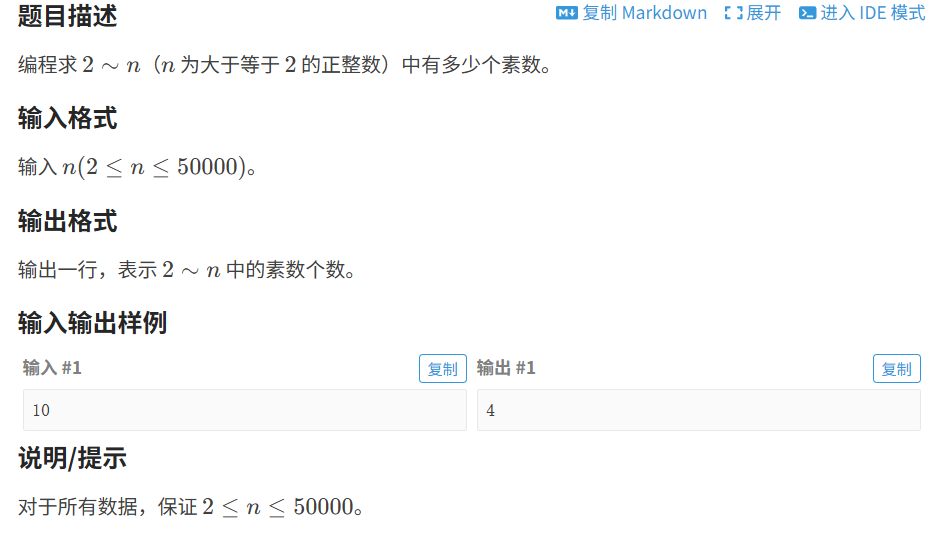

```java
import java.util.*;

public class Main{
    public static boolean check(int x){
        for(int i=2;i*i<=x;i++){
            if(x%i==0) return false;
        }
        return true;
    }
    public static void main(String [] args){
        Scanner sc= new Scanner(System.in);
        int n=sc.nextInt();
        int ans=0;
        for(int i=2;i<=n;i++){
            if(check(i)) ans++;
        }
        System.out.print(ans);
    }
}
```

### [洛谷：素数对](https://www.luogu.com.cn/problem/B2132)

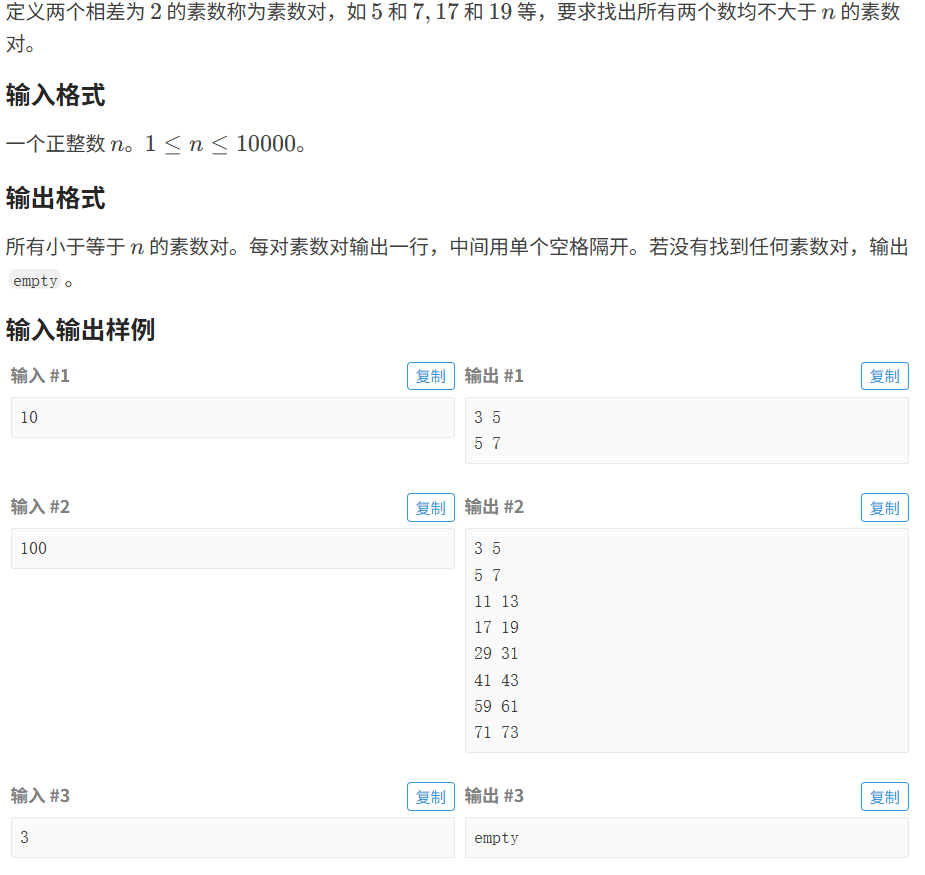

```java
import java.util.*;

public class Main{
    static ArrayList<Integer> al=new ArrayList<>();

    public static boolean check(int x){
        for(int i=2;i*i<=x;i++){
            if(x%i==0) return false;
        }
        return true;
    }
    public static void main(String [] args){
        Scanner sc =new Scanner(System.in);
        int n=sc.nextInt();
        for(int i=2;i<=n;i++){
            if(check(i)) al.add(i);
        }
        int count=0;
        for(int i=0;i<al.size()-1;i++){
            int a =al.get(i);
            int b =al.get(i+1);
            if(a+2==b){
                System.out.println(a+" "+b);
                count++;
            }
        }
        if(count==0) System.out.print("empty");
        
    }
}
```


### [洛谷：区间内的真素数](https://www.luogu.com.cn/problem/B2139)

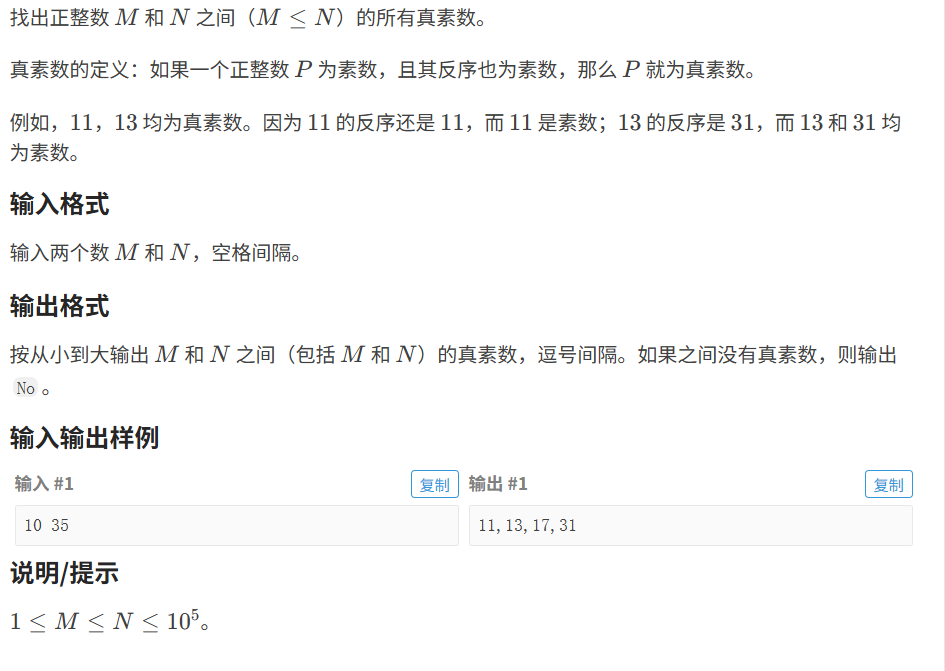

```java
import java.util.*;

public class Main{
    static ArrayList<Integer> al=new ArrayList<>();

    public static boolean check(int x){
        if (x < 2) return false;  //注意判断特殊情况 第一次没有判断这个 导致没有AC
        for(int i=2;i*i<=x;i++){
            if(x%i==0) return false;
        }
        return true;
    }
    public static void main(String [] args){
        Scanner sc =new Scanner(System.in);
        int m=sc.nextInt();
        int n=sc.nextInt();
        for(int i=m;i<=n;i++){
            if(check(i)) al.add(i);
        }
        int count =0;
        for(int i=0;i<al.size();i++){
            int b =al.get(i);
            int t=b;
            int c=0;
            while(b>0){
                c=c*10+b%10;
                b/=10;
            }
            
            if(check(c)){
                if(count==0) {
                    System.out.print(t);
                    count++;
                }
                else{
                    System.out.print(","+t);
                    count++;
                }
            } 
            
        }
        if(count==0) System.out.print("No");
        
    }
}
```


### [洛谷：哥德巴赫猜想](https://www.luogu.com.cn/problem/P1304)

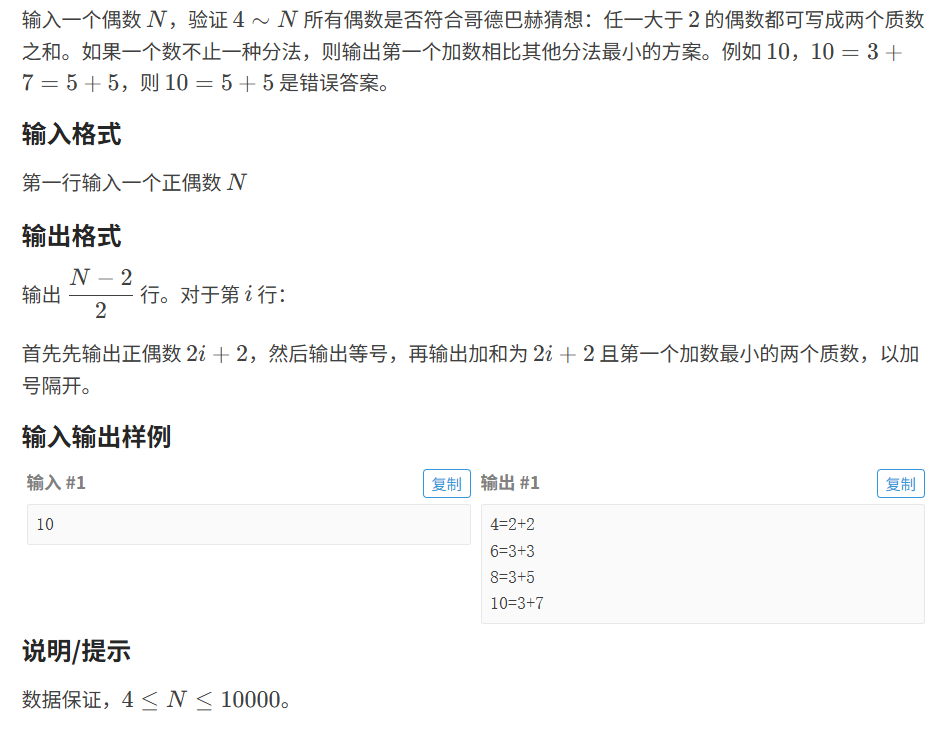

```java
import java.util.*;

public class Main{
    static ArrayList<Integer> al=new ArrayList<>();
    
    public static boolean check(int x){
        if (x < 2) return false;  
        for(int i=2;i*i<=x;i++){
            if(x%i==0) return false;
        }
        return true;
    }
    public static void main(String [] args){
        Scanner sc =new Scanner(System.in);
        int n = sc.nextInt();
        for(int i=2;i<=n;i++){ //将2-n的素数都存入ArrayList里面
            if(check(i)) al.add(i);
        }
        for(int i=4;i<=n;i+=2){
             for(int j=0;j<al.size();j++){
            	 int count=0;
                 int a =al.get(j);
                 if(a>i) break;
                 for(int k=0;k<al.size();k++){
                     int b =al.get(k);
                     if(b>i) break;
                     if(a+b==i){
                         System.out.println(i+"="+a+"+"+b);
                         count++;
                         break;
                     }

                 }
                 if(count>0) break;
             }
        }
    }
}
```

```c++
#include <bits/stdc++.h>
using namespace std;
//可以学一下这个思路,更简单
bool isprime(int n)
{
    if (n == 1)
        return 0;
    if (n == 2)
        return 1;
    for (int i = 2; i <= sqrt(n); i++)
    {
        if (n % i == 0)
            return 0;
    }
    return 1;
}

int n;

int main()
{
    cin >> n;
    for (int i = 4; i <= n; i += 2)
    {
        for (int j = 2; j <= i; j++)
        {
            if (isprime(j))
            {
                if (isprime(i - j))
                {
                    cout << i << "=" << j << "+" << i - j << endl;
                    break;
                }
            }
        }
    }
    return 0;
}
```

### [洛谷：阶乘数码](https://www.luogu.com.cn/problem/P2388)

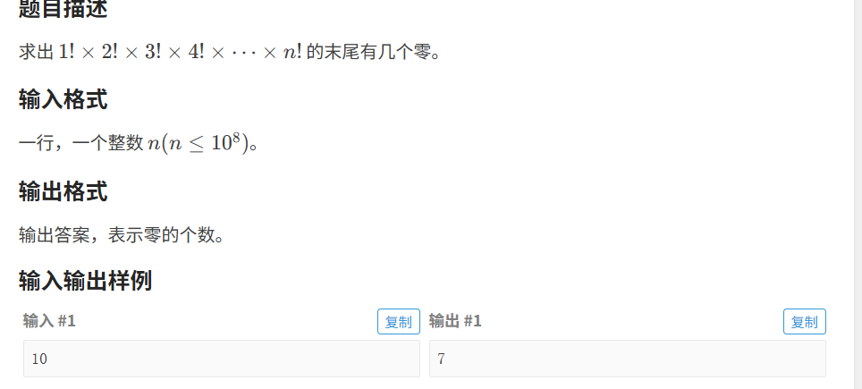

```java
import java.util.*;

public class Main{
		//只需要计算5的个数,为什么?
  	//因为5*2等于10 末尾就会多一个0
  	//而含2因子的个数肯定比5多 所以只需要计算5的个数
    public static void main(String [] args){
        Scanner sc=new Scanner(System.in);
        int n =sc.nextInt();
        long ans=0;
        int s=0;//累计 因为后面的阶乘会包含前面的阶乘5! 6! 7! 8! 9!都是一个5,10! 11!...14!都是两个5,依次累加
        for(int i=1;i<=n;i++){
            int now=i;
                while(now%5==0){
                    s++;
                    now/=5;
            }
            ans+=s;
        }
        System.out.print(ans);
    }
}
```


## day03 素数筛与分解质因数:

[洛谷：魔法科考试](https://www.luogu.com.cn/problem/P12157)


```java
import java.util.*;

public class Main{
    static final int N = 40007;
    static int[] primes = new int[N];
    static boolean[] st = new boolean[N]; //true 代表是素数


    public static void shai(int total){
        st[0]=false;
        st[1]=false;
        for (int i=2;i<=total;i++){
            st[i]=true;
        }
        for(int i=2;i<=total;i++){
            if(!st[i]) continue;
            for(int j=i+i;j<=total;j+=i){
                st[j]=false;
            }
        }
    }
    public static void main(String [] args){
        Scanner sc=new Scanner(System.in);
        int n=sc.nextInt();
        int m=sc.nextInt();
        int total=n+m;
        int[] a = new int[n];
        int[] b = new int[m];
        for (int i = 0; i < n; i++) a[i] = sc.nextInt();
        for (int i = 0; i < m; i++) b[i] = sc.nextInt();

        shai(total);

        HashSet<Integer> set=new HashSet<>();

        for(int i=0;i<n;i++){
            int ai=a[i];
            for(int j=0;j<m;j++){
                int bi=b[j];
                int S=ai+bi;
                if(S>total)continue;
                if(!st[S]) continue;
                set.add(S);
            }
        }
        System.out.println(set.size());
    }

}
```

[洛谷：哥德巴赫猜想（升级版）](https://www.luogu.com.cn/problem/P1579)


```java
import java.util.*;

public class Main{

        static final int N=20007;
        static int[] primes = new int[N];
        static boolean[] st = new boolean[N]; //false 代表是素数

        public static void main(String [] args){
            Scanner sc=new Scanner(System.in);
            int n =sc.nextInt();

            int cnt=0;
            for(int i=2;i<=n;i++){
                if(st[i]) continue; //如果是true直接跳过
                //false 的情况
                primes[cnt++]=i;
                for(int j=i+i;j<=n;j+=i) st[j]=true;
            }
            //筛完之后 素数都存在primes这个数组中
             for (int i = 0; i < cnt; i++) {
            // 中层循环 j 从 i 到 cnt-1，这样能保证第一个素数不会变大，同时让第二个素数尽可能小
            for (int j = i; j < cnt; j++) {
                // 内层循环 k 从 j 到 cnt-1，这样能保证前两个素数不变时，第三个素数尽可能小
                for (int k = j; k < cnt; k++) {
                    int sum = primes[i] + primes[j] + primes[k];
                    if (sum == n) {
                        System.out.printf("%d %d %d", primes[i], primes[j], primes[k]);
                        return;
                    }
                  // 优化：如果和已经大于n，可以提前结束内层循环
                    if (sum > n) {
                        break;
                    }
                }
            }
        }
        }
    }
```

[洛谷：素数密度](https://www.luogu.com.cn/problem/P1835)

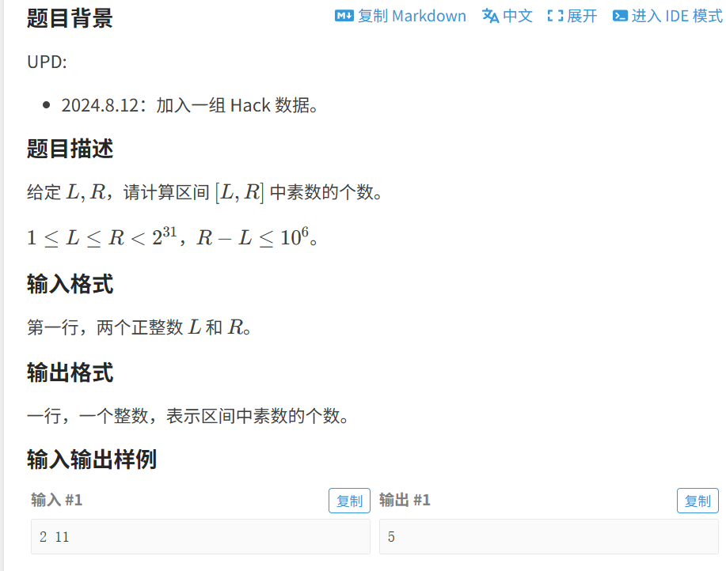

```java
import java.util.Scanner;

/**
 * 计算给定区间 [l, r] 内素数的个数。
 * 使用分段筛法 (Segmented Sieve of Eratosthenes)。
 */
public class Main {

    private static final int MAX_SIZE = 1000001;
    private static final int SQRT_MAX_R = 50000; // 根号R的最大值，用于预处理小素数

    // 预处理数组，存储小于SQRT_MAX_R的素数
    private static int[] prime = new int[MAX_SIZE];
    private static boolean[] vis = new boolean[MAX_SIZE]; // 用于标记是否为合数
    private static int cnt = 0; // 记录预处理素数的个数

    /**
     * 线性筛法预处理出 sqrt(SQRT_MAX_R) 范围内的所有素数
     * 注意：原C++代码中的Gprime函数实际上是标准的埃拉托斯特尼筛法，
     * 而不是线性筛。这里保持原意，实现标准筛法。
     */
    private static void generatePrimes() {
        // 初始化 vis 数组，false 表示可能是素数
        for (int i = 2; i <= SQRT_MAX_R; i++) {
            if (!vis[i]) {
                prime[++cnt] = i;
            }
            // 标记 i 的所有倍数为合数
            for (int j = 1; j <= cnt && i * prime[j] <= SQRT_MAX_R; j++) {
                vis[i * prime[j]] = true;
                // 标准筛法，不break
            }
        }
    }


   public static int countPrimesInRange(long L, long r) {
    if (r < 2) {
        return 0; // 如果r小于2，则区间内不可能有素数
    }
    
    // 特判L=1的情况，因为1不是素数，将其视为2
    if (L == 1) {
        L = 2; // 1不是素数，所以从2开始统计
    }

    // 如果是首次调用，先生成预处理的素数表
    if (cnt == 0) {
        generatePrimes(); // 只需执行一次预处理
    }

    // 创建一个布尔数组来标记区间 [l, r] 内的数是否为合数
    // 数组大小为 r - l + 1，索引 0 对应 l，索引 r-l 对应 r
    boolean[] segVis = new boolean[(int)(r - L + 1) + 1]; // 创建一个大小为区间长度的辅助数组

    // 遍历预处理得到的所有素数，用它们去筛掉区间 [l, r] 内的合数
    for (int i = 1; i <= cnt; i++) { // 遍历所有预处理好的小素数
        long p = prime[i]; // 当前用来筛的素数 p
        // 计算从哪个数开始标记，即大于等于l的最小的p的倍数
        // (l + p - 1) / p 得到大于等于 l/p 的最小整数，再乘以p
        long start = ((L + p - 1) / p) * p;
        
        // 确保起始点不小于 p*p (因为小于p*p的p的倍数已被更小的素数筛掉)
        // 这个判断是为了避免重复标记
        if (start < p * p) {
            start = p * p;
        }

        // 从 start 开始，以 p 为步长，标记区间 [l, r] 内的合数
        for (long j = start; j <= r; j += p) { // 从 start 开始，每次加 p
             // j >= l 确保索引不越界，虽然理论上循环条件已保证
             if (j >= L) { // 这个判断是冗余的，因为循环条件保证了 j <= r 且 start >= l 或 p*p
                 segVis[(int)(j - L)] = true; // 标记 j 是合数。 j-l 将 j 映射到 segVis 数组的索引上
             }
        }
    }

    // 统计区间 [l, r] 内未被标记的数（即素数）的个数
    int ans = 0;
    for (int i = 0; i <= r - L; i++) { // 遍历辅助数组 segVis
        if (!segVis[i]) { // 如果 segVis[i] 是 false，说明原始数字 l+i 没有被标记为合数，即它是素数
            ans++; // 计数器加一
        }
    }

    return ans; // 返回素数个数
}

    public static void main(String[] args) {
        Scanner scanner = new Scanner(System.in);
        long L = scanner.nextLong();
        long r = scanner.nextLong();

        int result = countPrimesInRange(L, r);
        System.out.println(result);

        scanner.close();
    }
}
```

**ai讲解**

https://www.qianwen.com/share/chat/b6db00629d994a4f8c21718bb7082c3c

[洛谷：质因数的个数](https://www.luogu.com.cn/problem/B4272)

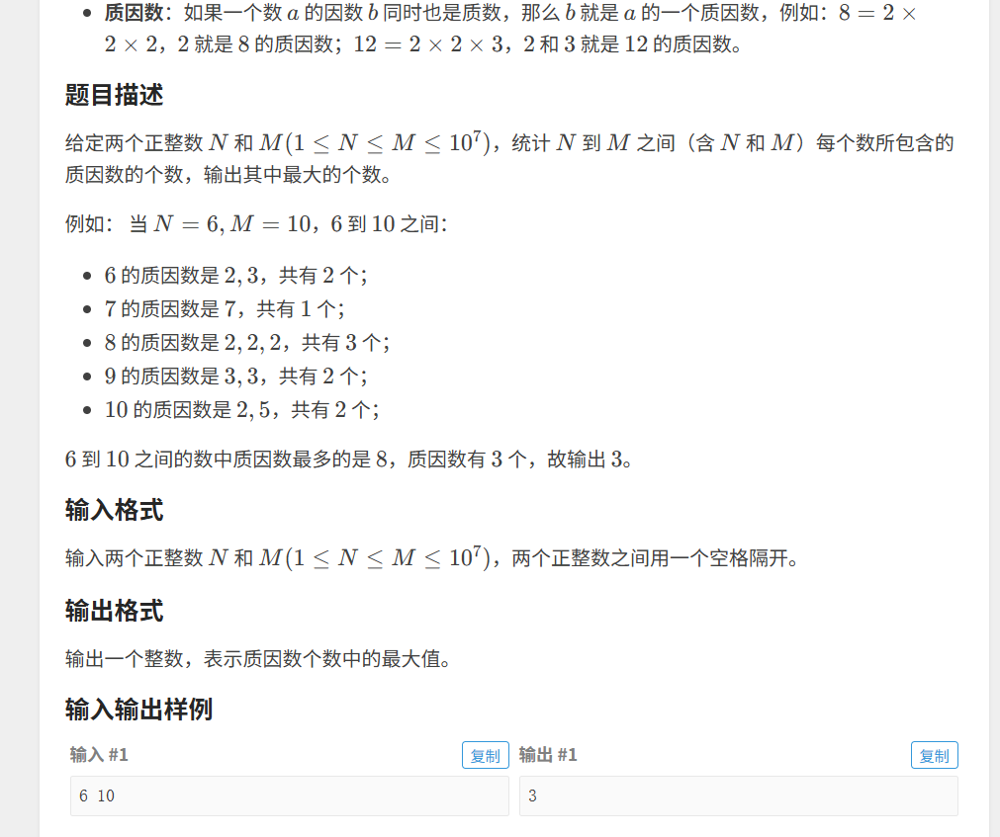

```java
import java.util.*;
//这个算法比暴力优化了,每个数的最小质因数,不需要再从2开始遍历,直接从最小质因数开始遍历
//比如49=7*7; 这个算法直接从7开始算,而我原来的从2依次遍历,会导致超时
public class Main{
    
    static int [] prime= new int [10000010];
    static int [] cnt= new int [10000010];
    //prime存最小质因数，cnt存质因数个数
    public static void aishishai(int m) {
    	prime[1] = 1;
        cnt[1] = 0;
    	for (int i = 2; i <= m; i++) {
    		if (prime[i] == 0) { //i为质数
    			prime[i] = i; //标记
    			for (int j = i * 2; j <= m; j += i) { //标记i的倍数
    				if (prime[j] == 0) { //
    					prime[j] = i; //标记
    				}
    			}
    		}
    		int x = i, cnts = 0;
    		while (x != 1) {
    			int p = prime[x]; //x的最小质因数
    			//除尽所有p
    			while (x % p == 0) {
    				cnts++;
                    x /= p; //计算结果并缩小范围
    			}
    		}
    		cnt[i] = cnts; //结果存入cnt数组
    	}
    }
    public static void main(String [] args) {
        	Scanner sc =new Scanner(System.in);
            int n=sc.nextInt();
            int m=sc.nextInt();
        	
        	aishishai(m); //预处理
        	int ans = 0;
        	for (int i = n; i <= m; i++) {
        		ans = Math.max(ans, cnt[i]); //求出n~m最多质因数的个数
        	}
        	System.out.print(ans);
        	sc.close();
    }
}
```

[洛谷：数的拆分](https://www.luogu.com.cn/problem/P8778)


# 基础算法:

## 枚举:


## 模拟:


## 前缀和与差分:

### [商品库存管理 - 洛谷P10903 [蓝桥杯 2024 省 C\]](https://www.luogu.com.cn/problem/P10903)

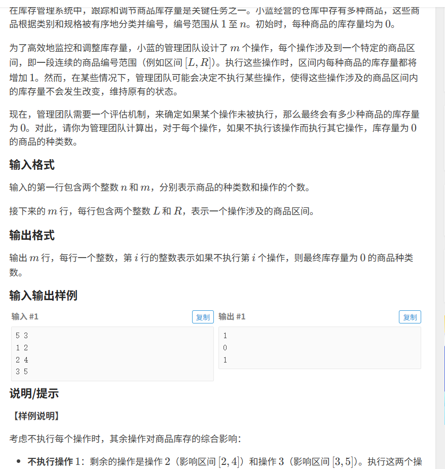

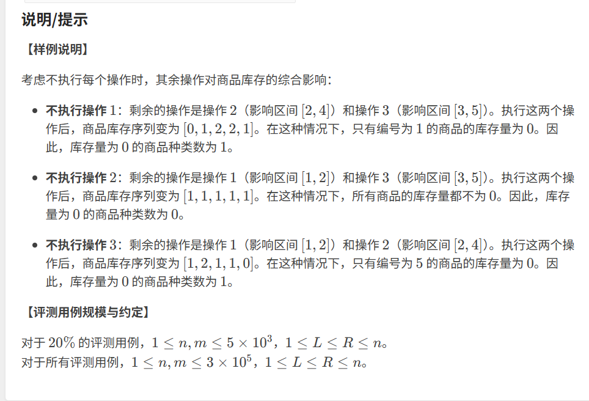

```java
//因为最初原数组都是0,所以差分数组也都是0,然后要对这个区间内的数字进行操作,利用差分数组的性质
//然后操作完之后,利用差分数组还原成原数组,然后构造前缀和数组,前缀和用来存储前多少个数组有多少
//个1,0的情况每次都在最后加上

import java.util.*;
import java.io.*;

public class Main{

    static int [] L =new int [300005];
    static int [] R =new int [300005];
    static int [] d =new int [300005]; //差分数组
    static int [] s =new int [300005];
    static int sum=0;


    static PrintWriter pw = new PrintWriter(new BufferedOutputStream(System.out));
    
    static StreamTokenizer in =new StreamTokenizer(new BufferedReader(new InputStreamReader(System.in)));
	public static int nextInt() throws IOException{
		in.nextToken();
		return (int) in.nval;
	}
    public static void main(String [] args)throws IOException{
        int n=nextInt();
        int m=nextInt();
        for(int i=1;i<=m;i++){
             L[i]=nextInt();
             R[i]=nextInt();
            d[L[i]]++;
            d[R[i]+1]--;
        }
        for(int i=1;i<=n;i++) d[i]=d[i]+d[i-1]; //将差分数组直接变成原数组
        for(int i=1;i<=n;i++){
            if(d[i]==0) sum++;
            s[i]=s[i-1]+(d[i]==1?1:0);  //构造前缀和数组
        }
        for(int i=1;i<=m;i++){
            pw.println(s[R[i]]-s[L[i]-1]+sum);
        }
        pw.flush();
        pw.close();
    }
}
```

### [ 棋盘 - 洛谷P13879 [蓝桥杯 2023 省 Java A\]](https://www.luogu.com.cn/problem/P13879)


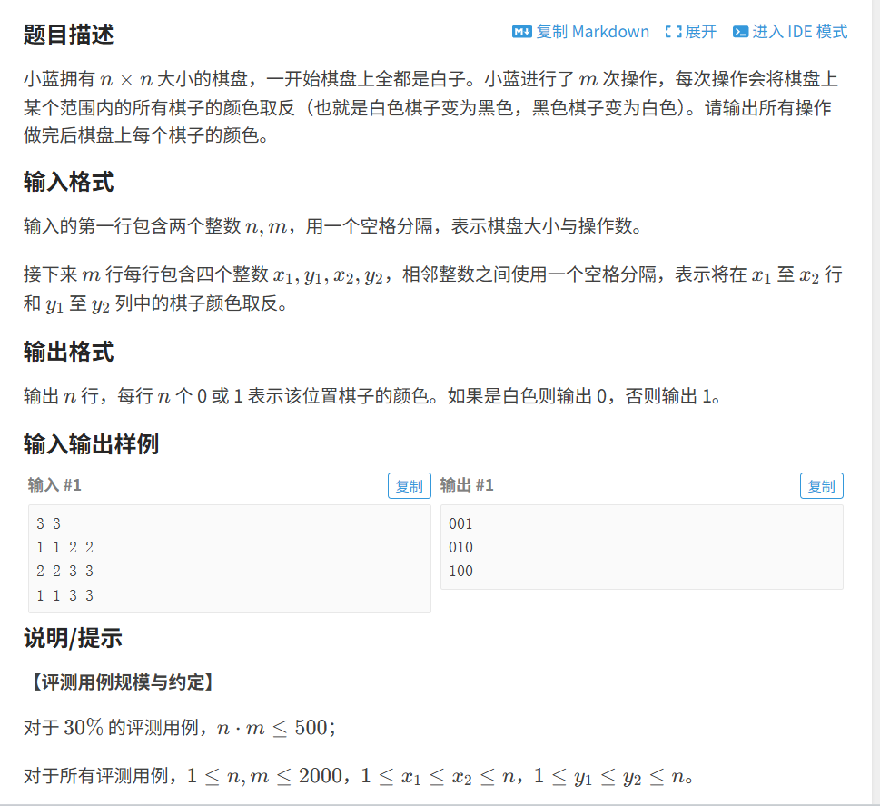

```java
import java.util.*;
import java.io.*;

public class Main{
    static final int N=2005;
    static int [][] st=new int [N][N]; 
    static int [][] d=new int [N][N];
    static int [][] a=new int [N][N];
    static StreamTokenizer in =new StreamTokenizer(new BufferedReader(new InputStreamReader(System.in)));
    public static int nextInt() throws IOException{
        in.nextToken();
        return (int) in.nval;
    }
    static PrintWriter pw=new PrintWriter(new BufferedOutputStream(System.out));
    
    public static void main(String [] args)throws IOException{
        int n=nextInt();
        int m=nextInt();
        for(int i=1;i<=m;i++){
            int x1=nextInt();
            int y1=nextInt();
            int x2=nextInt();
            int y2=nextInt();
            //最开始都是0,说明奇数是黑色,白色是偶数
            d[x1][y1]+=1;
            d[x2+1][y1]-=1;
            d[x1][y2+1]-=1;
            d[x2+1][y2+1]+=1;
        }
        //再把差分数组还原成原数组
        for(int i=1;i<=n;i++){
            for(int j=1;j<=n;j++){
                a[i][j]=a[i-1][j]+a[i][j-1]-a[i-1][j-1]+d[i][j];
            }
        }
      //输出结果
        for(int i=1;i<=n;i++){
            for(int j=1;j<=n;j++){
                if(a[i][j]%2==1) pw.print(1);
                else pw.print(0);
            }
            pw.println();
        }
        pw.flush();
      //输出 优化 快大概两秒
       /** StringBuilder sb = new StringBuilder();
        for(int i=1;i<=n;i++){
            for(int j=1;j<=n;j++){
                if(a[i][j]%2==1) sb.append(1);
                else sb.append(0);
            }
            sb.append('\n');
        }
        System.out.print(sb);
        */
    }
}
```


###  [自建OJ：买花](http://47.121.118.174/p/170)

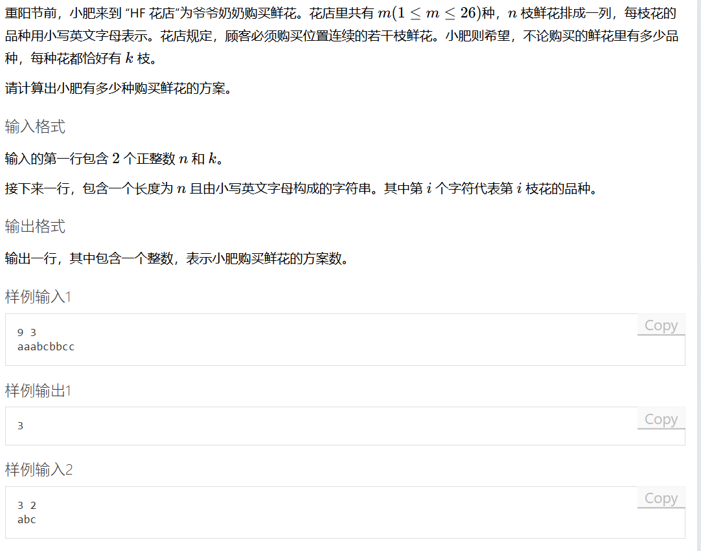

O( n^3^ ) 写法:   这个用来写上标 ^ 3 ^  这个写下标~ 2 ~   通过6个样例

```java
import java.util.*;
import java.io.*;

public class test {
    static  final int N=100005;


    static String str;
    static int k;
    static int n;
    
    public static boolean check(int L,int R){
        int [] a=new int[26];
        for(int i=L;i<=R;i++){
            a[str.charAt(i)-'a']++;
        }
        for (int i=0;i<26;i++){
            if(a[i]==0)continue;
            if(a[i]!=k) return false;
        }
        return true;
    }

    public  static void main(String [] args){
        Scanner sc=new Scanner(System.in);
         n=sc.nextInt();
         k=sc.nextInt();
         str=sc.next();
        str=" "+str;
        int ans=0;
        for(int i=1;i<=n;i++){
            for(int j=i;j<=n;j++){
                if(check(i,j)) ans++;
            }
        }
        System.out.println(ans);
    }
}
```

O(N ^2^)写法:  通过10个样例

```java
import java.util.Scanner;

public class Main {

    static final int N=100005;

    static int [][] s=new int [26][N];

    static int n;
    static int k;
    static String str;

    public static boolean check(int L,int R){
        for (int i=0;i<26;i++){
            int count=s[i][R]-s[i][L-1];
            if (count!=0 && count!=k)return false;
        }

        return  true;
    }

    public static void main(String[] args) {
        Scanner sc = new Scanner(System.in);
        n=sc.nextInt();
        k=sc.nextInt();
        str=sc.next();
        str=" "+str;
        //初始化前缀和数组
        for (int i=1;i<=n;i++) {
            for (int j=0;j<=25;j++){

                s[j][i]=s[j][i-1];
            }
            //前缀和数组每一项 等于 前一项加上当前项是不是对应的字母
            //对应的字母的前缀和数组 值+1
            s[str.charAt(i)-'a'][i]++;
        }
        int ans=0;
        //遍历字符串的所有字串
        for (int i=1;i<=n;i++) {
            for (int j=i;j<=n;j++) {
                if(check(i,j)) ans++;
            }
        }
        System.out.println(ans);
    }
}

```

O (N) 写法:  通过全部样例

```java
import java.util.Scanner;

public class Main {

    static final int N=100005;

    static int [][] s=new int [26][N];

    static int n;
    static int k;
    static String str;

    public static boolean check(int L,int R){
        for (int i=0;i<26;i++){
            int count=s[i][R]-s[i][L-1];
            if (count!=0 && count!=k)return false;
        }

        return  true;
    }

    public static void main(String[] args) {
        Scanner sc = new Scanner(System.in);
        n=sc.nextInt();
        k=sc.nextInt();
        str=sc.next();
        str=" "+str;
        //初始化前缀和数组
        for (int i=1;i<=n;i++) {
            for (int j=0;j<=25;j++){

                s[j][i]=s[j][i-1];
            }
            //前缀和数组每一项 等于 前一项加上当前项是不是对应的字母
            //对应的字母的前缀和数组 值+1
            s[str.charAt(i)-'a'][i]++;
        }
        int ans=0;
        //遍历字符串的所有字串
        //注意到题目要求，每种字符数量要恰好为k
        //则符合题目要求的区间长度其实只有k,2k,3k,...,25k,26k。
        //我们枚举区间长度
        for(int c=1;c<=26;c++){
            for (int i=c*k;i<=n;i++) {
                int L=1+i-c*k;
                int R=i;
                    if(check(L,R)) ans++;

            }
        }
        System.out.println(ans);
    }
}

```

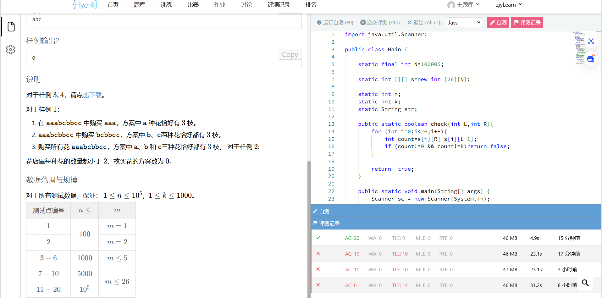


### [自建OJ：最少操作次数](http://47.121.118.174/p/335)

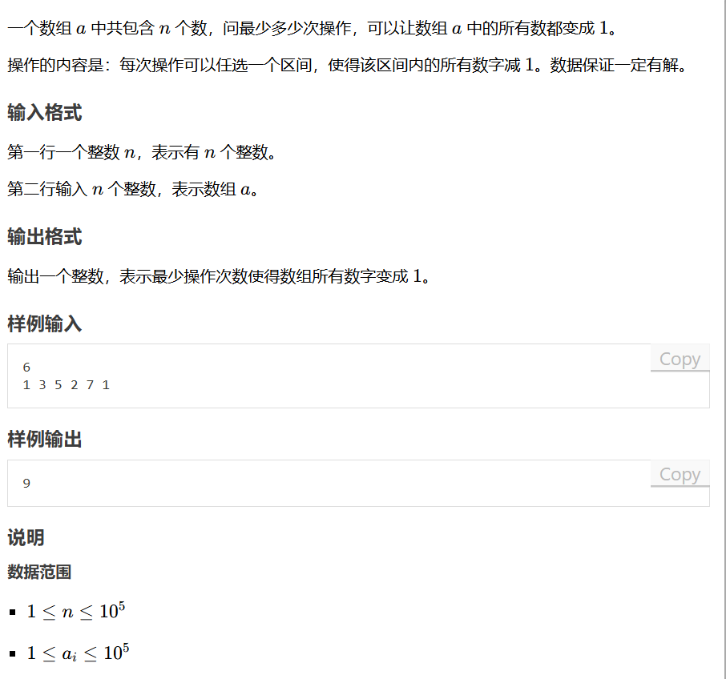

```java
import java.util.*;
import java.io.*;

public class Main{
    static final int N=100005;
    static int [] a=new int [N]; 
    static int [] d=new int [N];

    static StreamTokenizer in = new StreamTokenizer(new BufferedReader(new InputStreamReader(System.in)));

    public static int nextInt() throws IOException{
        in.nextToken();
        return (int)in.nval;
    }

    public static void main(String [] args) throws IOException{
        int n=nextInt();
        for(int i=1;i<=n;i++){
            a[i]=nextInt();
        }
        //构造差分数组:
        for(int i=1;i<=n;i++){
            d[i]=a[i]-a[i-1];
        }
        long ans=0;
       
        //我们要把原数组a所有数都变成1,那么对应的差分数组就要都变成0,除了
        //最后一个数为1
        //对差分数组每次操作时,对一个数-1,一定对应另一个数+1
        //除非是最后一个,只需要-1,所以每次操作就是一个数-1 另一个+1或者只-1
        //因为这个差分数组,正数和一定大于负数和(原数组都大于1)
        //所以可以转换为只计算 差分数组的正数和,最后再-1即可
        for(int i=1;i<=n;i++){
            if(d[i]>0) ans+=d[i];
        }
        //这里最后要减1,因为差分数组最后一个一定是1
        System.out.print(ans-1);
    }
}
```


### [二维前缀和 - 题目详情 - Hydro](http://47.121.118.174/p/42)

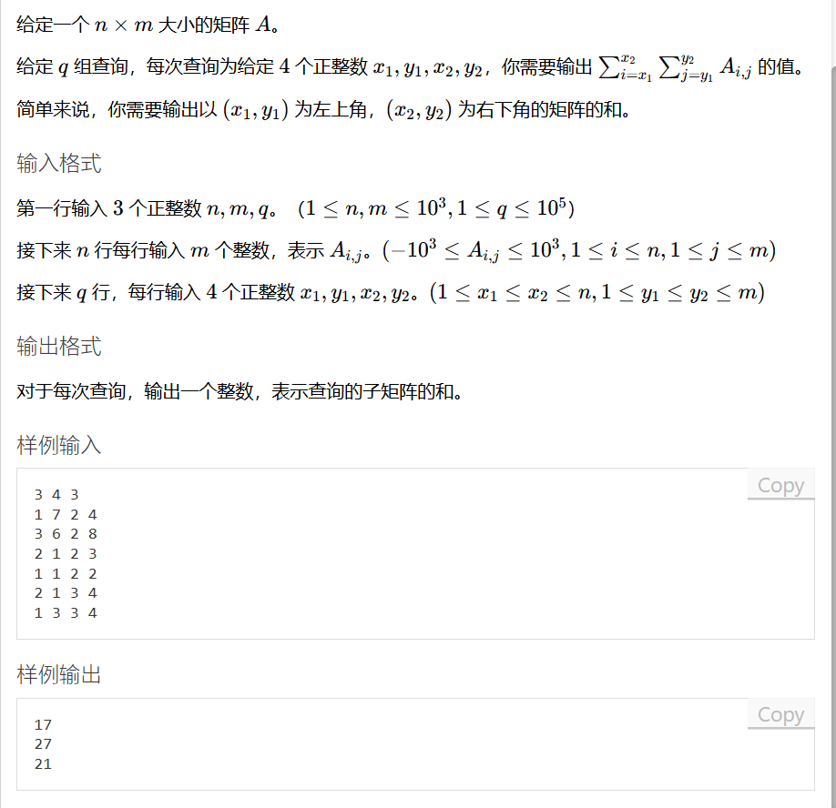

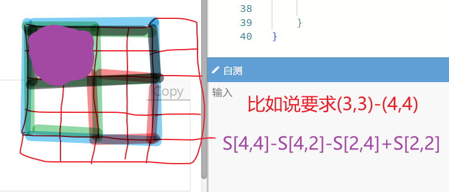

```java
//模板题:
import java.util.*;
import java.io.*;

public class Main{

    static final int N=1005;
    
    static int [][] a=new int[N][N];
    static int [][] s=new int[N][N];

    static StreamTokenizer in =new StreamTokenizer(new BufferedReader(new InputStreamReader(System.in)));

    public static int nextInt() throws IOException{
        in.nextToken();
        return (int)in.nval;
    }

    public static void main(String [] args)throws IOException{
        int n=nextInt();
        int m=nextInt();
        int q=nextInt();
        for(int i=1;i<=n;i++){
            for(int j=1;j<=m;j++){
                a[i][j]=nextInt();
                //初始化前缀和数组
                s[i][j]=s[i-1][j]+s[i][j-1]-s[i-1][j-1]+a[i][j];
            }
        }
        StringBuilder sb=new StringBuilder();
        for(int i=1;i<=q;i++){
            //查询:
            int x1=nextInt();
            int y1=nextInt();
            int x2=nextInt();
            int y2=nextInt();
            //用前缀和数组来求区间和
            int ans=s[x2][y2]-s[x2][y1-1]-s[x1-1][y2]+s[x1-1][y1-1];
            sb.append(ans+"\n");
        }
        System.out.print(sb);
    }
}
```


### [自建OJ：二维差分](http://47.121.118.174/p/41)

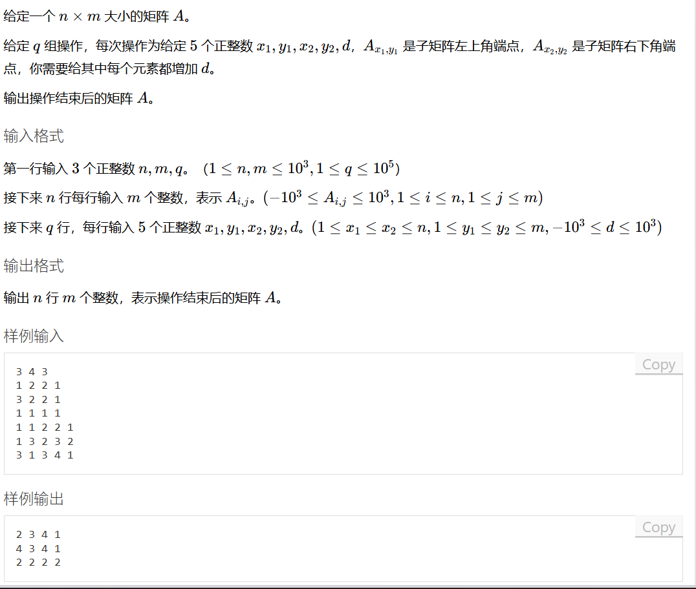

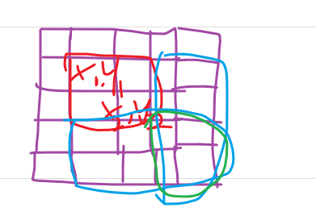

```java
import java.util.*;
import java.io.*;

public class Main{
    static StreamTokenizer in = new StreamTokenizer(new BufferedReader(new InputStreamReader(System.in)));

    public static int nextInt() throws IOException{
        in.nextToken();
        return (int) in.nval;
    }
    public static void main(String [] args) throws IOException{
        int n =nextInt();
        int m =nextInt();
        int q =nextInt();
        int [][] a =new int [n+5][m+5];
        int [][] D =new int [n+5][m+5];
        for(int i=1;i<=n;i++){
            for(int j=1;j<=m;j++){
                a[i][j]=nextInt();
                //初始化差分数组:
                D[i][j]=a[i][j]-a[i-1][j]-a[i][j-1]+a[i-1][j-1];
            }
        }
        for(int i=1;i<=q;i++){
            //像这种对原数组进行区间整体操作的可以转换为对差分数组的操作
            int x1=nextInt(),y1=nextInt(),x2=nextInt(),y2=nextInt(),d=nextInt();
            //对差分数组进行操作
            D[x1][y1]+=d;
            D[x2+1][y1]-=d;
            D[x1][y2+1]-=d;
            D[x2+1][y2+1]+=d;
        }
        //接下来还原数组
        StringBuilder sb=new StringBuilder();
        for(int i=1;i<=n;i++){
            for(int j=1;j<=m;j++){
                a[i][j]=a[i][j-1]+a[i-1][j]-a[i-1][j-1]+D[i][j];
                sb.append(a[i][j]+" ");
            }
            sb.append("\n");
        }
        System.out.println(sb);
    }
}
```


### [自建OJ：闪耀的灯光](http://47.121.118.174/p/617)


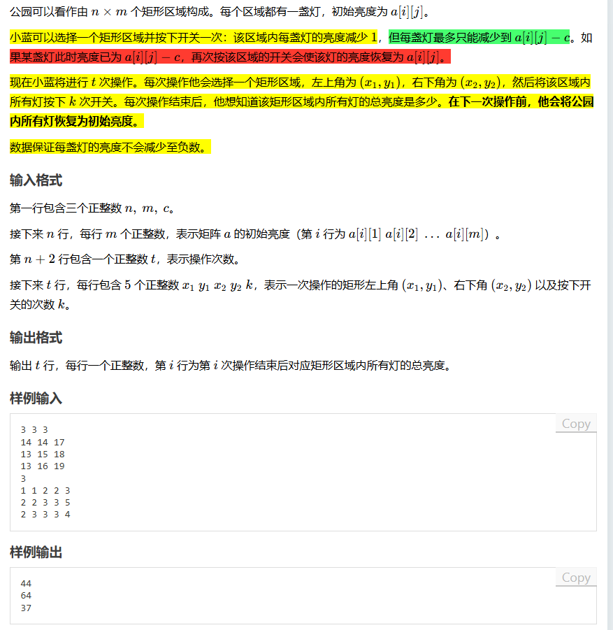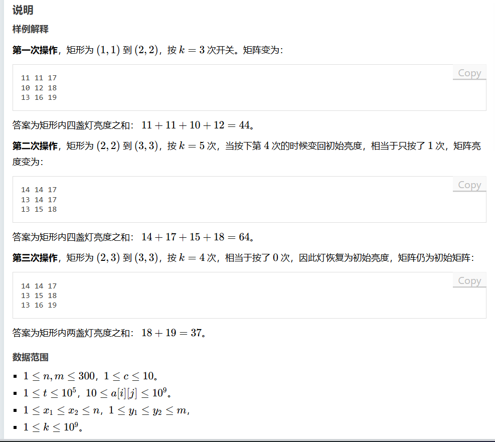

```java
/*
注意这道题有坑,我最初看到这道题要进行区间操作,直接去用差分数组了
但是这道题t次操作,每次操作前都会恢复初始亮度,而用差分数组会改变原数组
而且这道题肯定要用到前缀和数组,原数组改变,前缀和数组也要改变,
我们改变数组之后,每次都要再求原数组,再求前缀和数组 O(tmn) 会超时

这道题可以只用前缀和数组,初始化前缀和数组之后,我们每次操作,区间内所有灯泡都会减少同样的亮度
因为每次操作前都会还原亮度,所以我们只需要用前缀和数组求出区间和后
我们再减去这区间内减少的亮度和即可(d*(x2-x1+1)*(y2-y1+1)) d=k%(c+1)
因为操作c次后,下一次操作就会还原亮度,所以周期是 c+1,所以最后就等同于
只操作了d次
*/

import java.util.*;
import java.io.*;

public class Main{

    static int [][] a=new int [305][305];
    static long [][] s=new long [305][305];


    static StreamTokenizer in =new StreamTokenizer(new BufferedReader(new InputStreamReader(System.in)));

    public static int nextInt() throws IOException{
        in.nextToken();
        return (int) in.nval;
    }

    public static void main(String [] args)throws IOException{
        int n=nextInt();
        int m=nextInt();
        int c=nextInt();

        //初始化 每个矩阵的初始亮度
        for(int i=1;i<=n;i++){
            for(int j=1;j<=m;j++){
                a[i][j]=nextInt();
                //初始化前缀和数组
                s[i][j]=s[i-1][j]+s[i][j-1]-s[i-1][j-1]+a[i][j];
            }
        }

        int t=nextInt();
        //t次操作:
        StringBuilder sb =new StringBuilder();
        for(int i=1;i<=t;i++){
            int x1=nextInt();
            int y1=nextInt();
            int x2=nextInt();
            int y2=nextInt();
            int k=nextInt();
            int d=k%(c+1);
            int cnt=(x2-x1+1)*(y2-y1+1);
            //只需要用前缀和数组求出区间和,然后呢,再减去每个灯泡减掉的亮度
            long sum=s[x2][y2]-s[x2][y1-1]-s[x1-1][y2]+s[x1-1][y1-1];
            sum-=cnt*d;
            sb.append(sum+"\n");
        }
        System.out.print(sb);

    }
}
```


### [等和三分划分方案数 - 题目详情 - Hydro](http://47.121.118.174/p/513)

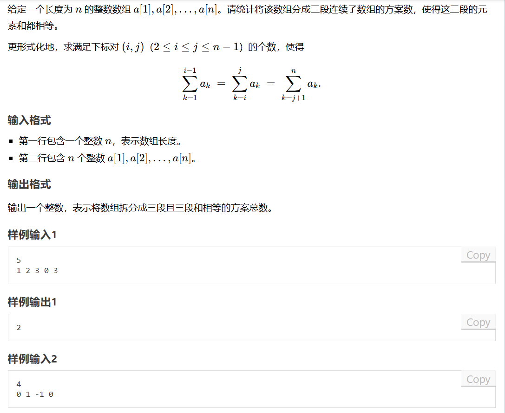

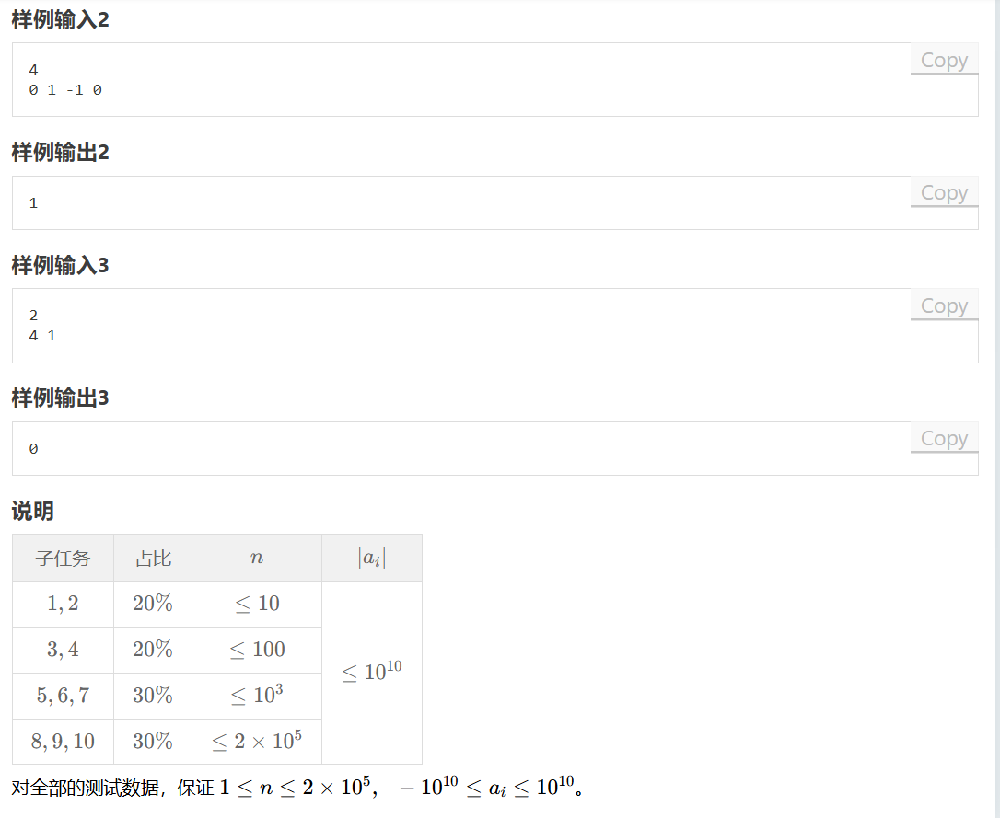
